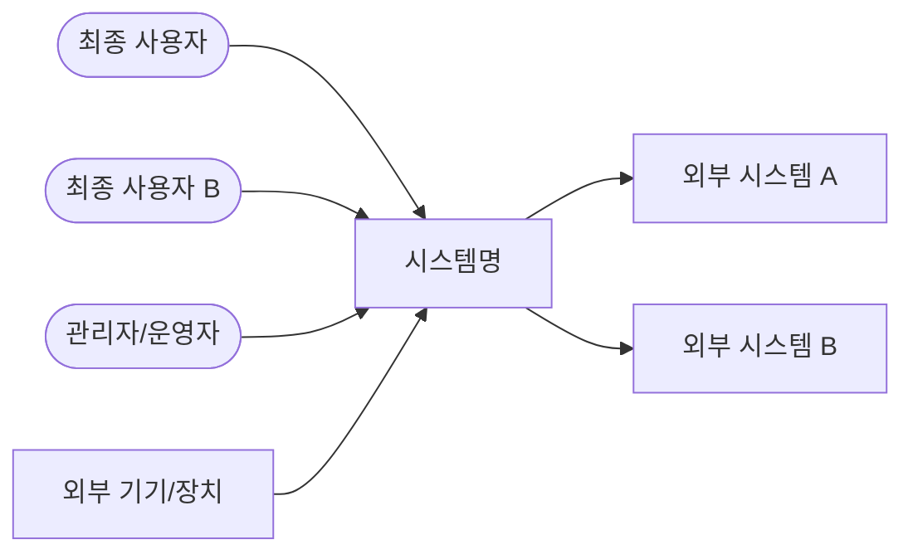
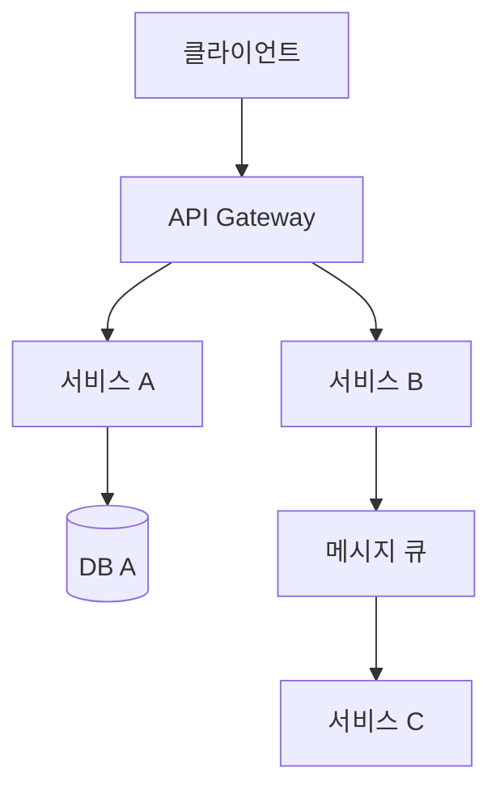
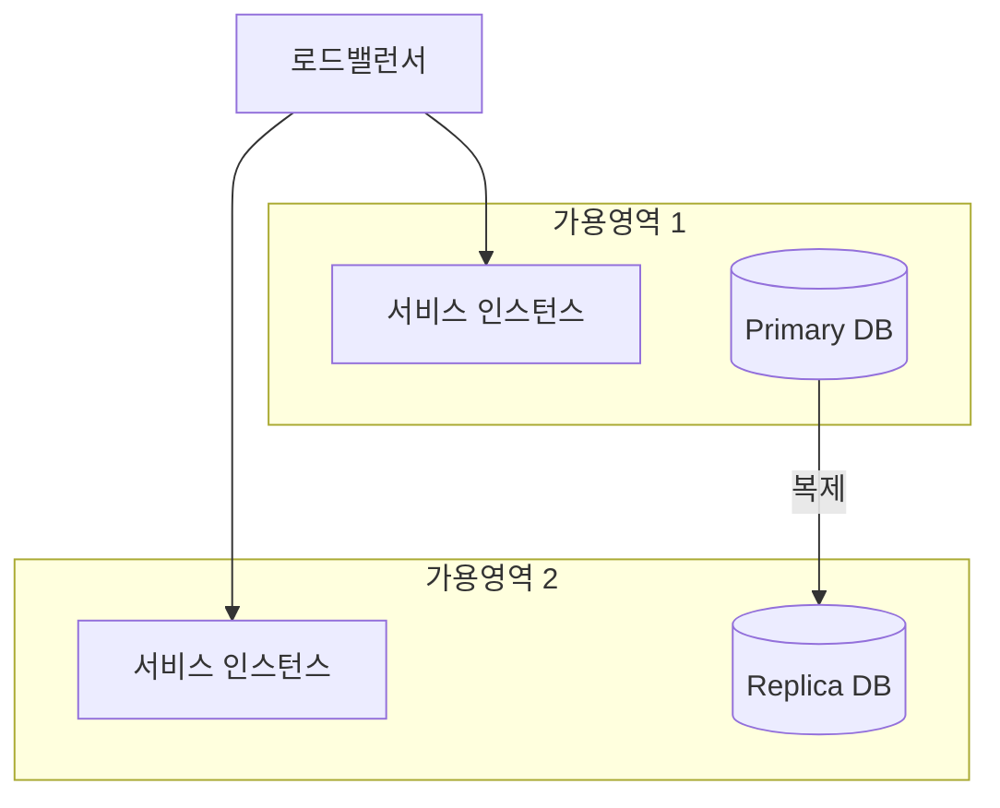

# ACAD Skill — Architecture-Centric AI-native Development (Stages 1–5)

## 개요

ACAD는 ASR(Architecture Significant Requirements) 기반 아키텍처 설계 방법론이다.
AI를 처음부터 설계 프로세스에 내재하여 아키텍트와 협업하는 방식(AI-native)으로 동작한다.

**7단계 파이프라인 중 이 스킬은 1~5단계(설계 영역)를 담당한다:**

```
① 아키텍처 스토리  →  ② ASR 도출  →  ③ 아키텍처 합성  →  ④ 아키텍처 검증  →  ④.5 Implementation Plan
```

각 단계는 이전 단계의 산출물을 입력으로 받으며, 사용자가 명시적으로 중단하지 않는 한 순서대로 진행한다.
단계별로 완성된 산출물을 제시하고 다음 단계 진행 여부를 확인한다.

---

## 사용 시점

- 사용자가 새로운 시스템/서비스의 아키텍처 설계를 요청할 때
- "ACAD 방식으로" 라는 키워드가 포함될 때
- 아키텍처 스토리, ASR 도출, 아키텍처 합성/검증 중 하나 이상을 언급할 때
- 이미 작성된 arch-story.md 또는 architecture-drivers.md를 바탕으로 다음 단계를 요청할 때

---

## ACAD 실행 원칙

1. **맥락 수집 우선**: 시스템 이름만 주어졌거나 설명이 부족하면 바로 산출물 작성에 들어가지 않는다. 반드시 ① 자유 서술 요청 → ② 범위·제약 구조화 질문 순서로 맥락을 수집한다. AI가 시스템 이름에서 추론한 기능 선택지를 먼저 제시하면 편향과 누락이 생기므로, 기능은 반드시 사용자가 직접 서술하게 한다
2. **측정 가능한 ASR**: 모호한 품질 속성을 수용하지 않는다. "빨라야 한다" → "99%의 요청이 0.5초 이내 응답" 수준으로 구체화한다
3. **트레이드오프 명시**: 모든 아키텍처 결정에는 감수해야 할 트레이드오프가 있음을 명확히 기술한다
4. **실패 대안 포함**: 채택하지 않은 대안과 그 이유를 함께 기록하여 의사결정 근거를 남긴다
5. **산출물 중심**: 각 단계 종료 시 다음 단계에서 입력으로 사용 가능한 Markdown 산출물을 생성한다
6. **파일 저장 필수**: 각 단계 확정 즉시 `/mnt/user-data/outputs/` 에 파일로 저장하고 present_files로 제공한다. 대화창 출력만으로는 부족하다 — 사용자가 다운로드할 수 있어야 한다
6. **다이어그램 코드 자체 검증 필수**: 모든 단계(Stage 1~4)에서 다이어그램 코드를 작성한 후 사용자에게 제시하기 전에 반드시 문법 오류를 자체 검토한다. Mermaid와 PlantUML 모두 해당한다.
   - **Mermaid**: 노드 라벨 `\n` 개행 금지, `[[]]` 사용 금지, 화살표 문법 확인
   - **PlantUML**: `@startuml`/`@enduml` 쌍 확인, 다이어그램 타입별 키워드 혼용 금지:
     - `box`·`collections` → 시퀀스 다이어그램 전용. 컴포넌트 다이어그램에서 사용 금지
     - 컴포넌트 다이어그램 그룹핑: `package` 또는 `node` 사용
     - 컴포넌트 다이어그램 큐 표현: `queue` 사용 (`collections` 금지)
     - `queue` (버전 의존) 불안정 시 `component`로 대체하고 레이블로 구분
   - 검증이 불확실한 경우 사용자에게 plantuml.com 또는 mermaid.live에서 확인을 안내한다

---

## Stage 1: 아키텍처 스토리 작성

**산출물**: `arch-story.md`

### 목적
SW 시스템이 **누구를 위해 존재하고 무엇을 해야 하는지** 간명히 정의한다.
이 단계의 산출물이 이후 모든 ASR과 아키텍처 결정의 근거가 된다.
시작이 흔들리면 이후 모든 단계가 흔들린다.

**프로세스**: 맥락 수집 → 초안 작성 → 사용자 확인(확정 체크포인트) → 확정 후 Stage 2 진행

---

### 맥락 수집 전략

맥락 수집은 **두 단계**로 나눈다.

**[Step A] 오픈 질문 — 항상 첫 번째로**

사용자가 시스템 이름만 제공한 경우, 선택지를 제시하기 전에 반드시 자유 서술을 요청한다:

> "어떤 문제를 해결하는 시스템인지, 주요 사용자와 핵심 기능을 간략히 설명해 주세요."

이 단계를 건너뛰고 AI가 추론한 선택지를 먼저 제시하면 기능 정의에 편향이 생기고,
사용자가 없는 기능을 고르거나 진짜 핵심 기능을 놓칠 위험이 있다.

**[Step B] 구조화 질문 — Step A 이후 범위·제약 확인**

사용자 설명을 바탕으로 아직 확인되지 않은 항목을 선택지 위젯(multi_select)으로 묻는다:

| 항목 | 질문 유형 | 예시 선택지 |
|------|---------|-----------|
| 플랫폼 | multi_select | iOS/Android, 웹, 관리자 대시보드 |
| 사용자 규모 | single_select | ~5천, ~2만, ~5만, 멀티테넌트 |
| 팀 제약 | multi_select | 소규모(~5명), 인프라 전담 없음, 빠른 MVP |
| 클라우드 선호 | single_select | AWS, GCP, Azure, 무관 |

> ⚠️ **선택지 편향 경고**: Step B의 선택지는 Step A에서 사용자가 직접 언급한 내용을
> 기반으로 구성한다. 시스템 이름에서 임의로 추론한 기능 목록을 선택지로 제시하지 않는다.

---

### 산출물 구조 (`arch-story.md`)

```markdown
# 아키텍처 스토리: [시스템명]

## 1. 시스템 정의 — "누가, 왜, 무엇을"
> [시스템이 해결하는 핵심 문제를 1~2문장으로. 기술 용어 없이 누구나 읽을 수 있게]

- **주요 사용자**: [역할 유형 나열]
- **핵심 가치**: [이 시스템이 없으면 사용자가 겪는 불편 / 있으면 얻는 이점]

## 2. 시스템 범위

### In-Scope (이 시스템이 책임지는 것)
- [기능 또는 도메인 1]
- [기능 또는 도메인 2]

### Out-of-Scope (명시적으로 제외)
- [제외 항목 1 — 이유 포함]
- [제외 항목 2]

### 컨텍스트 다이어그램 (Context Diagram)

> 📌 **포함해야 할 엔티티**: 최종 사용자만 그리면 안 된다. 다음 네 가지 유형을 모두 검토한다:
> - **최종 사용자**: 서비스를 직접 이용하는 사람
> - **관리자/운영자**: 시스템을 관리·운영하는 내부 사용자
> - **외부 연동 시스템**: SSO, 결제 PG, 지도 API 등 시스템이 의존하는 외부 서비스
> - **외부 기기/장치**: IoT 기기, 센서 등 시스템과 통신하는 물리적 장치
>
> Stage 2 기능 드라이버 도출 시 이 다이어그램의 모든 엔티티가 출처가 된다.
> 여기서 빠진 엔티티는 Stage 2에서도 놓치게 된다.



> 💡 **Mermaid 처음 접하는 경우**: 위 코드를 [mermaid.live](https://mermaid.live) 에 붙여넣으면
> 브라우저에서 바로 다이어그램을 확인하고 편집할 수 있다. 설치 불필요.

> ⚠️ **다이어그램 코드 작성 원칙**
> AI가 다이어그램 코드를 작성한 후 사용자에게 제시하기 전에 반드시 다음을 자체 검토한다:
> - Mermaid: 노드 라벨에 `\n`, `[[]]` 사용 여부, 화살표 문법 오류
> - PlantUML: `@startuml`/`@enduml` 쌍, 지원되지 않는 키워드(`queue` 등 버전 의존), box 내부 participant 타입 오류
> - 검증이 불확실한 경우: plantuml.com 또는 mermaid.live에서 확인 후 제시한다고 명시
>
> **PlantUML 안전한 participant 타입**: `participant`, `actor`, `boundary`, `control`, `entity`, `database`, `collections`
> `queue`는 버전에 따라 미지원일 수 있으므로 `collections`로 대체한다.

## 3. 핵심 시나리오 (Use Cases 초안)

### 기능 시나리오
| # | 역할 | 시나리오 | 핵심 품질 속성 |
|---|------|---------|--------------|
| S1 | [역할] | [누가, 어떤 상황에서, 무엇을 한다] | [성능/보안/가용성 등] |

### 비기능 요구사항 초안
| 품질 속성 | 기대 수준 (측정 가능한 형태) | 근거 시나리오 |
|---------|--------------------------|------------|
| 성능 | [예: 95%의 요청이 1초 이내] | S1, S2 |
| 가용성 | [예: 99.9% 업타임] | S1 |
| 보안 | [예: 개인정보보호법 준수] | S3 |

## 4. 제약사항 & 가정사항

### 확정된 제약
- **기술**: [플랫폼, 기술 스택 제약]
- **팀**: [규모, 경험, 역할]
- **일정**: [MVP 목표 시점]
- **법규/정책**: [준수해야 할 규정]

### 가정사항 ⚠️
> 확인되지 않았으나 설계에 반영한 것들. 검증 후 제약사항으로 이동하거나 수정한다.
- [가정 1]: [내용] — 확인 필요: [누가, 언제]
- [가정 2]: [내용] — 확인 필요: [누가, 언제]

## 5. 미래 방향 (선택)
- [향후 1~2년 내 예상되는 주요 변화]
```

---

### 확정 체크포인트 ← Stage 2 진행 전 반드시 거친다

초안 제시 후 사용자에게 다음 세 가지를 명시적으로 확인한다:

1. **범위 확인**: "시스템 범위(In/Out-of-Scope)가 맞나요? 빠진 것이나 잘못 포함된 것이 있나요?"
2. **시나리오 확인**: "핵심 시나리오 중 빠진 것이 있나요? 우선순위가 다른 것이 있나요?"
3. **가정사항 확인**: "가정사항 중 틀린 것이 있나요?"

사용자가 명시적으로 확인하면 `arch-story.md`를 **확정**하고 Stage 2로 진행한다.
"다음으로 진행할까요?"만으로는 확정이 아니다 — 사용자가 범위·시나리오·가정에 동의해야 한다.

> 📄 **파일 생성 — 확정 즉시 수행**
> 사용자가 확정하면 지금까지 대화에서 작성한 내용을 `/mnt/user-data/outputs/arch-story.md`로 저장한다.
> 저장 후 present_files 도구로 사용자에게 다운로드 링크를 제공한다.

---

## Stage 2: ASR 도출

**입력**: arch-story.md
**산출물**: `architecture-drivers.md`

### 목적
이해관계자 요구사항 중 아키텍처에 유의미한 영향을 미치는 것들을 아키텍처 드라이버로 도출한다.
드라이버는 비기능 요구사항(품질 속성)만이 아니라 기능 요구사항과 제약사항도 포함한다.
이 산출물이 이후 아키텍처 합성·검증의 평가 기준이 된다.

> **드라이버 판별 기준**: "이 요구사항이 없다면 아키텍처가 달라졌을까?" — Yes이면 드라이버다.

### 아키텍처 드라이버 세 가지 유형

**① 기능적 드라이버 (Functionally Significant Requirements)**
기능 요구사항 중 특정 아키텍처 구조를 강제하는 것들.
단순 CRUD는 해당하지 않으나, 다음 특성을 가진 기능은 드라이버다:
- 데이터가 사용자 요청 없이 **자동으로** 갱신되어야 하는 기능
- 물리적 기기나 외부 시스템을 **원격으로** 제어해야 하는 기능
- 동일한 기능이 **여러 플랫폼에서 모두** 동작해야 하는 기능
- 외부 계정으로 **별도 가입 없이** 인증해야 하는 기능

> 🔍 **컨텍스트 다이어그램 전체 엔티티를 출처로 삼아라**
> 기능 드라이버는 최종 사용자 시나리오만 보면 놓치는 것이 많다.
> 컨텍스트 다이어그램의 **모든 엔티티** — 사용자, 관리자, 외부 시스템, 기기 — 가 드라이버의 출처다.
> 각 엔티티에서 시스템으로 들어오는 방향(inbound)과 시스템에서 나가는 방향(outbound) 모두 검토한다.
>
> | 엔티티 유형 | 놓치기 쉬운 드라이버 예시 |
> |-----------|----------------------|
> | 외부 시스템 (IoT, PG 등) | 외부 시스템의 이벤트를 시스템이 먼저 수신해야 하는가? |
> | 관리자 | 이상 상황을 시스템이 먼저 감지해 관리자에게 알려야 하는가? |
> | 연동 시스템 (SSO 등) | 인증·결제 처리를 완전히 외부에 위임해야 하는가? |

> ⚠️ **기능적 드라이버 작성 원칙 — 요구사항 언어를 지켜라**
> - **What(무엇을)** 언어로 쓴다. How(어떻게)는 Stage 3에서 결정한다
> - 아키텍처적 신호는 **수식어**에 담는다: "자동으로", "원격으로", "모두에서", "별도 가입 없이"
> - 솔루션 용어(WebSocket, API-first, OAuth 등)를 요구사항에 쓰지 않는다
>
> | ❌ 솔루션 언어 (잘못된 예) | ✅ 요구사항 언어 (올바른 예) |
> |------------------------|------------------------|
> | 서버→클라이언트 실시간 푸시가 필요하다 | 위치 정보는 사용자 요청 없이 자동으로 갱신되어야 한다 |
> | IoT 원격 제어 레이어가 필요하다 | 물리적 기기를 앱에서 원격으로 제어할 수 있어야 한다 |
> | API-first 설계가 필요하다 | 동일한 기능이 앱과 웹 브라우저에서 모두 동작해야 한다 |

> 📐 **수량과 묶음 기준**
> 기능적 드라이버의 수는 목표가 아니다. 기능 요구사항들을 나열한 뒤,
> **같은 아키텍처적 관심사를 공유하는 것끼리 묶는다. 묶음의 수가 드라이버의 수다.**
> - "셔틀 위치 자동 갱신"과 "기기 배터리 자동 갱신"은 같은 관심사 → 하나로 묶음
> - "기기 원격 제어"는 전혀 다른 관심사 → 별도 드라이버
> - 시스템에 따라 3개일 수도, 15개일 수도 있다. 억지로 맞추지 않는다

> 🏷️ **기능적 드라이버의 우선순위 척도: MVP / Phase 2 / Future**
> 기능 드라이버의 우선순위는 **개발 순서·범위**를 나타낸다.
> 품질 속성의 P0/P1/P2(아키텍처 중요도)와 혼용하면 두 의미가 모호해지므로 반드시 분리한다.
> - **MVP**: 첫 출시에 반드시 포함
> - **Phase 2**: 초기 출시 후 다음 단계
> - **Future**: 장기 로드맵, 현재 아키텍처에서 고려만

**② 품질 속성 ASR (Quality Attribute Requirements)**
측정 가능한 비기능 요구사항. 아래 분류 기준으로 도출한다:

| 분류 | 코드 | 설명 |
|------|------|------|
| 성능 | P | 응답 시간, 처리량, 지연 |
| 확장용이성 | C | 트래픽 급증, 사용자 증가 대응 |
| 가용성 | A | 업타임, 장애 복구 시간 |
| 보안 | S | 인증/인가, 암호화, 규정 준수 |
| 변경용이성 | M | 신기능 추가, 배포 주기, 기술 교체 |
| 사용편의성 | U | UI/UX 일관성, 에러 피드백 |
| 테스트용이성 | T | 단위/통합 테스트 가능성 |

> 🗳️ **품질 속성 우선순위는 AI가 임의로 확정하지 않는다 — 이해관계자 검토 필수**
>
> AI가 제시하는 P0/P1/P2는 **초안(draft)** 이다. 이해관계자마다 중시하는 품질 속성이
> 다르고, 그 충돌 지점이 바로 Stage 3 트레이드오프 분석의 핵심이 된다.
> (정식으로는 QAW(Quality Attribute Workshop)을 통해 확정하지만,
> 최소한 이해관계자 관점의 재검토 체크포인트는 반드시 거쳐야 한다.)
>
> **사용자에게 보이는 안내 문구 — QAW 용어 노출 금지**
> 품질 속성 드라이버 초안을 제시할 때 다음과 같이 자연스럽게 안내한다:
>
> > "우선순위는 P0(가장 높음) > P1 > P2 입니다.
> > AI가 초안을 잡았지만, 실제로 중요한 건 **이해관계자 입장에서 봤을 때** 입니다.
> > 아래 관점으로 한번 검토해 주세요."
>
> 그 다음 이해관계자별 관점을 자연스럽게 질문한다. "경량 QAW", "QAW 검토" 같은 용어는 사용자에게 노출하지 않는다.
>
> **⚠️ P0 의존 관계 체크 — 우선순위 확정 전 반드시 검토**
> 품질 속성은 독립적이지 않다. P0로 설정한 속성이 다른 속성을 전제 조건으로 요구하는 경우,
> 그 전제 조건도 P0여야 한다. 그렇지 않으면 P0 달성이 구조적으로 불가능해진다.
>
> 전형적인 의존 관계 예시:
> - **가용성 P0** → 피크 트래픽을 버텨야 함 → **확장용이성도 P0 필요**
> - **성능 P0** → 캐싱·비동기 처리 구조 필요 → **변경용이성이 낮으면 전술 적용 불가**
> - **보안 P0** → 인증 레이어가 모든 요청을 통과 → **가용성이 낮으면 인증 자체가 SPOF**
>
> P0 목록 확정 후 다음을 반드시 확인한다:
> "각 P0 달성의 전제 조건이 되는 다른 품질 속성이 P1/P2로 설정되어 있지 않은가?"
>
> **이해관계자별 관점에서 우선순위 검토**
>
> | 이해관계자 | 주로 중시하는 속성 | 핵심 질문 |
> |---------|----------------|---------|
> | 최종 사용자 | 성능, 가용성, 사용편의성 | 느리거나 다운되면 바로 이탈하는가? |
> | 관리자/운영팀 | 변경용이성, 가용성 | 기기 추가·장애 대응이 얼마나 중요한가? |
> | 경영진/학교 | 보안, 비용 효율성 | 규정 위반이나 데이터 사고가 치명적인가? |
> | 개발팀 | 변경용이성, 테스트용이성 | 빠른 배포와 테스트가 생존 조건인가? |
>
> AI는 초안을 제시한 뒤 다음 질문으로 검토를 유도한다:
> - "P0으로 잡은 항목들이 미달 시 실제로 출시를 막을 수준인가요?"
> - "이해관계자 중 이 우선순위에 동의하지 않을 그룹이 있나요?"
> - "P0끼리 충돌(트레이드오프)이 발생한다면 무엇을 포기하겠습니까?"
> - "P1/P2로 설정한 항목 중 P0 달성의 전제 조건이 되는 것이 있지 않나요?"
>   (예: 가용성 P0인데 확장용이성이 P2라면 피크 트래픽에서 가용성 달성 불가)
>
> 이 검토를 거쳐 확정된 우선순위만이 Stage 3 아키텍처 합성의 평가 기준이 된다.

**③ 제약사항 ASR (Constraints)**
설계 선택지 자체를 제한하는 요소. 선택이 아닌 주어진 조건이다:
- 기술 제약: 반드시 써야 하거나 쓸 수 없는 기술
- 조직/팀 제약: 팀 규모, 역량, 운영 가능 범위
- 법규/정책 제약: 반드시 준수해야 하는 규정
- 예산/일정 제약: 아키텍처 복잡도를 제한하는 현실적 조건

### 우선순위 정의

> ⚠️ **P0이 가장 높은 우선순위다.** 숫자가 작을수록 우선순위가 높다. (P0 > P1 > P2)
> 일부 방법론에서 P1이 최우선이거나 P0가 "미분류"를 의미하기도 하므로 혼동 주의.

- **P0 (필수)**: 미달 시 시스템을 출시/운영할 수 없음 — 가장 높은 우선순위
- **P1 (중요)**: 미달 시 비즈니스 목표 달성에 심각한 영향
- **P2 (보통)**: 개선되면 좋지만 초기 버전에서는 타협 가능

### ASR 작성 기준
각 ASR은 반드시 다음을 포함해야 한다:
- **자극(Stimulus)**: 무엇이 발생하는가
- **환경(Environment)**: 어떤 상황/조건에서
- **반응(Response)**: 시스템이 어떻게 동작해야 하는가
- **측정 기준(Measure)**: 숫자로 검증 가능한 기준

### 산출물 구조 (`architecture-drivers.md`)

```markdown
# 아키텍처 드라이버: [시스템명]

## 1. 기능적 드라이버 (Functionally Significant Requirements)
> 아키텍처 구조를 강제하는 기능 요구사항. 솔루션 용어 없이 What 언어로 작성.
> 우선순위: MVP(첫 출시 필수) / Phase 2(다음 단계) / Future(장기 로드맵)

| ID | 우선순위 | 요구사항 (What 언어) | 아키텍처적 관심사 |
|----|---------|------------------|----------------|
| AD-F001 | MVP | [기능]은 [수식어: 자동으로/원격으로/모두에서] [동작]해야 한다 | [이 특성이 요구하는 아키텍처 관심사] |
| AD-F002 | Phase 2 | ... | ... |

## 2. 품질 속성 드라이버 (Quality Attribute Requirements)
> 우선순위: **P0(가장 높음, 미달 시 출시 불가)** / P1(비즈니스 목표 심각한 영향) / P2(타협 가능)
> ※ 숫자가 작을수록 우선순위가 높습니다. P0 > P1 > P2
> ※ P0/P1/P2는 기능 드라이버의 MVP/Phase 2와 별개다. 트레이드오프 분석에 사용된다.

### 성능 (Performance)
| ID | 우선순위 | 시나리오 | 측정 기준 |
|----|---------|---------|---------|
| AD-P001 | P0 | [역할]이 [기능]을 요청할 때, [조건] 하에서 | [X]% 요청이 [Y]ms 이내 응답 |

### 확장용이성 (Scalability)
| ID | 우선순위 | 시나리오 | 측정 기준 |
|----|---------|---------|---------|
| AD-C001 | P0 | 트래픽이 [X]배 급증할 때 | 수동 개입 없이 [Y]초 내 스케일 아웃 |

### 가용성 (Availability)
| ID | 우선순위 | 시나리오 | 측정 기준 |
|----|---------|---------|---------|
| AD-A001 | P0 | 핵심 서비스 운영 중 | 연간 [X]% 가용성 (다운타임 [Y]분 이내) |

### 보안 (Security)

> 🛡️ **보안 ASR 도출 시 — OWASP 관점 체크 조건부 제안**
> 컨텍스트 다이어그램에 다음 중 하나라도 있으면 사용자에게 한 줄로 제안한다:
> - PII·결제·의료 등 민감 데이터를 다루는 경우
> - 외부 인증(SSO), 결제 PG, 외부 API 연동이 있는 경우
>
> 제안 문구 예시:
> > "[외부 결제 연동 / PII 처리]가 있어서 보안 ASR 도출 시 OWASP 관점으로 위협을 체크할 수 있습니다. 원하시나요?"
>
> 사용자가 동의하면 아래 체크리스트를 적용한다. 동의하지 않으면 일반 보안 ASR 작성으로 진행한다.
> 위 조건이 없는 시스템은 제안 자체를 생략한다.
>
> **OWASP 체크리스트** (동의한 경우에만 적용):
>
> | OWASP 관점 | 확인 질문 | 아키텍처 영향 |
> |-----------|---------|------------|
> | 인증/인가 (A01·A07) | 외부 계정 연동이 있는가? 역할별 접근 제어가 필요한가? | 인증 레이어 위치 결정 |
> | 민감 데이터 (A02) | PII·결제·의료 등 규정 대상 데이터가 있는가? | 암호화·저장소 분리 |
> | 인젝션 (A03) | 외부 입력이 DB·명령어·외부 시스템에 직접 전달되는가? | 입력 검증 레이어 |
> | 설계 취약점 (A04) | 인증 없이 접근 가능한 내부 API가 있는가? | API Gateway 설계 |
> | 외부 연동 무결성 (A08·A10) | 외부 API·라이브러리 결과를 검증 없이 수신하는가? | 외부 연동 경계 설계 |
>
> 각 위협: **실제 공격 시나리오** → **아키텍처 수준 완화 방안** → **ASR로 기술**
> 세부 보안 구현(알고리즘, 토큰 만료 시간 등)은 Stage 4 전술 선택에서 결정한다.

| ID | 우선순위 | 시나리오 | 측정 기준 |
|----|---------|---------|---------|
| AD-S001 | P0 | 민감 정보 처리 시 | [규정] 준수, [암호화 방식] 적용 |

### 변경용이성 (Modifiability)
| ID | 우선순위 | 시나리오 | 측정 기준 |
|----|---------|---------|---------|
| AD-M001 | P1 | 신규 기능 추가 시 | 기존 시스템 영향 없이 [X]주 이내 배포 |

### 사용편의성 (Usability)
| ID | 우선순위 | 시나리오 | 측정 기준 |
|----|---------|---------|---------|
| AD-U001 | P1 | 사용자가 [기능] 사용 시 | [측정 기준] |

## 3. 제약사항 (Constraints)
> 선택이 아닌 주어진 조건. 아키텍처 선택지를 직접 제한한다.
>
> ⚠️ **제약사항 검토 원칙 — 더 단순한 대안을 먼저 질문한다**
> 제약을 당연히 받아들이면 불필요한 복잡도가 아키텍처에 고정된다.
> AI는 각 제약에 대해 다음을 함께 검토한다:
> - "이 제약이 정말 필수인가?"
> - "더 단순한 방식으로 같은 목적을 달성할 수 있는가?"
>
> 예) IoT 게이트웨이가 기기 상태 관리에 필수라고 가정 → 검토 결과
> 예약·결제 기반으로 상태 관리 가능 → IoT는 잠금 해제 제어 용도로만 한정
> → 불필요한 복잡도 제거, 제약사항 범위 축소

| ID | 유형 | 제약 내용 | 아키텍처 영향 |
|----|------|---------|------------|
| AD-CON001 | 팀/조직 | [팀 규모, 역량 한계] | [운영 가능한 복잡도 제한] |
| AD-CON002 | 일정 | [MVP 기한] | [초기 아키텍처 복잡도 상한] |
| AD-CON003 | 법규 | [준수 규정명] | [데이터 처리·저장 방식 제한] |
| AD-CON004 | 기술 | [반드시 써야/쓸 수 없는 기술] | [설계 선택지 제한 내용] |

## 4. 우선순위 요약

### 기능 드라이버 로드맵 (개발 순서 기준)
| ID | 요구사항 요약 | 우선순위 | 근거 |
|----|------------|---------|------|
| AD-F001 | ... | MVP | ... |
| AD-F002 | ... | Phase 2 | ... |

### 품질 속성 드라이버 매트릭스 (트레이드오프 분석 기준)
| ID | 품질 속성 | 우선순위 | 아키텍처 영향도 |
|----|---------|---------|-------------|
| AD-P001 | 성능 | P0 | 높음 — [영향] |
| AD-C001 | 확장용이성 | P0 | 높음 — [영향] |
```

### 실행 방식 — 섹션별 순차 확인

Stage 2는 전체를 한 번에 제시하지 않는다. 섹션별로 작성 → 사용자 확인 → 다음 섹션 순서로 진행한다.
한 번에 모든 결과를 보여주면 리뷰가 형식적이 되고 실질적인 확인이 어렵기 때문이다.

```
① 피처 목록 작성 (이용자 유형별 + 자연스러운 흐름 순)
      ↓ 사용자 확인 (누락·순서·우선순위)
② 기능적 드라이버 도출 (피처 → 드라이버 매핑 명시)
      ↓ 사용자 확인 (선별·묶음·제외 근거)
③ 품질 속성 드라이버 작성 (초안)
      ↓ 우선순위 체계 먼저 안내 — 반드시 초안 제시 전에 한 줄로 명시한다:
         "우선순위는 P0(가장 높음) > P1 > P2 순입니다. P0는 미달 시 출시가 불가한 수준입니다."
      ↓ 사용자 확인 — 이해관계자 관점에서 우선순위 검토
         ("경량 QAW" 등 방법론 용어 노출 금지. 자연스러운 질문으로 유도)
      ↓ 사용자 확인 — 측정 기준 수치 검토
      ↓ 사용자 확인 — 측정 기준 수치 검토
         "응답 시간·가용성 %·동시 접속 수 등 수치가 실제 요구에 맞나요?
          AI가 추정한 값이므로 반드시 이해관계자와 확인이 필요합니다."
④ 제약사항 작성
      ↓ 사용자 확인
⑤ 우선순위 요약 매트릭스 작성
      ↓ 최종 확인 → Stage 3 진행
```

> ⚠️ **피처 목록 작성 원칙**
> - 이용자 유형별로 구분하고, 각 유형 내에서 자연스러운 사용 흐름 순으로 정렬한다
> - 이렇게 하면 누락된 기능이 눈에 띄고 이해관계자 검토가 쉬워진다
> - 피처는 구체적인 사용자 행동 수준으로 기술한다 (추상적 관심사가 아닌 실제 기능)

> ⚠️ **기능적 드라이버 도출은 명시적으로 보여준다**
> 피처 목록 → 드라이버 선별 → 관심사 묶기 과정을 사용자에게 명시적으로 보여주고 확인받는다.
> 이 판단을 AI가 조용히 처리하면 설계자가 동의 여부를 확인할 수 없고,
> "왜 이 기능은 드라이버에 없나?"라는 질문에 근거를 댈 수 없게 된다.
> 개발자에게 생소한 개념이더라도 명시적으로 두는 것이 ACAD의 원칙("의사결정 근거를 남긴다")에 맞다.
>
> 제시 형식:
> - 드라이버로 선별된 피처: 관련 피처 ID를 함께 표시
> - 드라이버에서 제외된 피처: 드라이버 표 아래에 한 줄 요약으로만 처리
>   예) "F07·F09·F13 등 N개 피처는 CRUD 수준으로 드라이버에서 제외. 상세 근거가 필요하면 질문해 주세요."
>   제외 이유를 피처마다 전부 나열하면 드라이버가 묻히므로 요약만 표시한다.

각 섹션 확인 시 사용자가 수정을 요청하면 해당 섹션을 수정한 뒤 다음으로 넘어간다.

### 확정 체크포인트 ← Stage 3 진행 전 반드시 거친다

④ 우선순위 요약 매트릭스까지 모두 확인된 후, 최종적으로 다음을 확인한다:

1. **누락 드라이버**: 기능·품질·제약 중 빠진 것이 있나요?
2. **우선순위 일관성**: 섹션 간 우선순위가 서로 모순되지 않나요?
3. **Stage 3 준비**: 이 드라이버들이 아키텍처 합성의 평가 기준으로 충분한가요?

사용자가 명시적으로 확인하면 `architecture-drivers.md`를 **확정**하고 Stage 3로 진행한다.
드라이버가 틀리면 이후 아키텍처 합성과 검증 전체가 흔들리므로 이 체크포인트는 특히 중요하다.

> 📄 **파일 생성 — 확정 즉시 수행**
> 사용자가 확정하면 지금까지 작성한 드라이버 전체를 `/mnt/user-data/outputs/architecture-drivers.md`로 저장한다.
> 저장 후 present_files 도구로 사용자에게 다운로드 링크를 제공한다.

---

## Stage 3: 아키텍처 합성

**입력**: arch-story.md + architecture-drivers.md
**산출물**: `architecture.md`

### 목적
ASR(품질 속성·기능·제약)을 기준으로 아키텍처 스타일·패턴 후보를 평가하고 최적 아키텍처를 확정한다.
기존에 방향이 정해진 경우에도, 그 결정이 ASR에 가장 부합하는지 검증하고 확정한다.

> **아키텍처 스타일이란**: 도메인에 무관하게 반복적으로 나타나는 설계 문제에 대한 검증된 해결 방식이다.
> 시스템을 어떤 구조로 나눌 것인가, 컴포넌트들이 어떻게 소통할 것인가를 결정하는 큰 그림이다.
> (예: Layered, Event-Driven, Microservices, Pipe-and-Filter 등)
>
> **아키텍처 패턴이란**: 스타일보다 도메인 특성이 강하게 반영된 구체적 솔루션이다.
> (예: CQRS, Saga, API Gateway, Repository, Circuit Breaker 등)
>
> **스타일과 패턴의 관계**: 상하 계층이 아니라 범위의 차이다. 겹치는 것도 많고 조합해서 쓰는 것이 일반적이다.
> 스타일을 먼저 고르고 패턴을 고르는 순서가 항상 맞는 건 아니다 —
> 함께 후보군으로 놓고 ASR 기준으로 평가한다.

> **평가 기준 우선순위**:
> - **주 기준**: 품질 속성 드라이버 P0 — 스타일·패턴 선택을 가장 강하게 결정
> - **보조 기준**: 기능 드라이버 — 특정 스타일·패턴을 강하게 요구하는 것이 있으면 함께 고려
>   (예: Layered 스타일은 변경용이성(품질)에 반응하는 동시에 기능을 계층별로 모듈화하는 구조적 해답이기도 함)
> - **제약**: 팀·일정 제약(AD-CON001·002)은 기술적으로 우수한 후보도 배제할 수 있는 hard constraint

### 실행 방식 — 섹션별 순차 확인

Stage 3도 전체를 한 번에 제시하지 않는다. 섹션별로 작성 → 사용자 확인 → 다음 섹션 순서로 진행한다.

```
① 아키텍처 스타일·패턴 후보 비교 평가
      ↓ 사용자 확인 (배제 대안 재검토, 누락 후보 여부)
② 최종 선택 + 트레이드오프
      ↓ 사용자 확인
③ 뷰 선택 (CMU 3 View 기준)
      ↓ 사용자 확인 (어떤 뷰를 그릴 것인가)
④ 선택된 뷰 다이어그램 (순서대로)
      ↓ 각 뷰마다 사용자 확인
⑤ 기술 스택
      ↓ 최종 확인 → Stage 4 진행
```

> 📐 **ACAD 표준 뷰 라이브러리: CMU 3 View**
>
> ACAD는 CMU(카네기멜론대) 소프트웨어공학연구소의 3 View를 표준으로 사용한다.
> 아키텍처를 하나의 다이어그램으로 표현할 수 없다 — 관점(뷰)에 따라 다르게 보인다.
> 이해관계자가 무엇을 알아야 하는가에 따라 필요한 뷰를 선택해서 그린다.
>
> | 뷰 | 한 줄 정의 | 주요 독자 | 핵심 질문 |
> |---|-----------|---------|---------|
> | **Module 뷰** | 코드 구조 — 시스템이 어떻게 모듈로 나뉘는가 | 개발팀 | 어떤 모듈이 있고 서로 어떻게 의존하는가? |
> | **C&C 뷰** | 런타임 상호작용 — 실행 중 컴포넌트들이 어떻게 소통하는가 | 개발팀, 아키텍트 | 런타임에 데이터가 어떻게 흐르는가? |
> | **Allocation 뷰** | 배포 인프라 — 소프트웨어가 어떤 환경에 올라가는가 | 운영팀, 인프라팀 | 어떤 서버·클라우드에 어떻게 배포되는가? |
>
> 세 뷰 모두 그릴 필요는 없다. 시스템 복잡도와 이해관계자 필요에 따라 선택한다.
> 단, 선택하지 않은 뷰는 그 이유를 명시한다.

### 실행 순서

**Step 1: 후보 선정**
시스템 ASR을 보고 유력한 스타일·패턴 후보 3개 내외를 선정한다.
스타일과 패턴을 구분하지 말고 함께 후보군으로 놓는다.
설계 초보자를 위해 각 후보의 한 줄 정의를 함께 제시한다.

**Step 2: ATAM 방식 비교 평가**
각 후보를 품질 속성 P0 드라이버 기준으로 평가하되,
기능 드라이버 중 특정 구조를 강하게 요구하는 것이 있으면 함께 반영한다.
달성도는 ●●●(충족) / ●●○(부분) / ●○○(미달)로 표시한다.

> 💰 **팀·일정 제약(AD-CON001·002)이 있을 때 — 비용-편익 수치화 필수**
> 기술적으로 우수한 대안이 현실적으로 선택 불가능한지 수치로 검증한다.
> 특히 단순한 아키텍처의 대안으로도 비즈니스 목표를 달성할 수 있는지 반드시 확인한다:
>
> | 검증 항목 | 확인 질문 |
> |---------|---------|
> | 구현 기간 | 팀 학습 곡선을 포함해 [X주] 내 달성 가능한가? |
> | 운영 비용 | 월 [Y원] 수준으로 지속 가능한가? |
> | 비즈니스 임팩트 | 이 아키텍처로 달성하는 목표가 추가 비용·복잡도를 정당화하는가? |
> | 단순 대안 검토 | 더 단순한 아키텍처 + 프로세스 개선으로도 비즈니스 목표의 N%를 달성할 수 있는가? |
>
> ⚠️ "기술적으로 더 나은 아키텍처"가 항상 올바른 선택이 아니다.
> 단순한 대안으로 비즈니스 목표를 달성할 수 있다면, 복잡도를 감수할 근거를 명시해야 한다.

**Step 3: 최종 확정 및 세부 설계**
- 선정 이유와 감수하는 트레이드오프 명시
- 채택하지 않은 대안의 배제 이유 기록
- 컴포넌트 뷰, 배포 뷰를 Mermaid 다이어그램으로 시각화

### 산출물 구조 (`architecture.md`)

```markdown
# 아키텍처: [시스템명]

## 아키텍처 스타일 비교 평가 (ATAM 기반)

### [스타일 1명]
- **특징**: ...
- **장점**: ...
- **단점**: ...
- **ASR 달성도**: 확장용이성 ●●○, 변경용이성 ●●●, 가용성 ●○○
- **결론**: [채택/배제 및 이유]

### [스타일 2명]
...

## 최종 선택: [아키텍처 스타일명]

**선택 이유**: [ASR 기준으로 가장 우수한 이유]
**감수하는 트레이드오프**: [무엇을 희생하는가]
**완화 전략**: [트레이드오프를 어떻게 관리할 것인가]

## 뷰 선택 및 다이어그램 도구 선택

### 그릴 뷰 선택 (CMU 3 View 기준)
이해관계자 필요에 따라 필요한 뷰를 선택한다. 선택하지 않은 뷰는 이유를 명시한다.

| 뷰 | 그릴 것인가 | 이유 |
|---|-----------|------|
| Module 뷰 | ✅/❌ | [이유] |
| C&C 뷰 | ✅/❌ | [이유] |
| Allocation 뷰 | ✅/❌ | [이유] |

> **뷰 작성 순서**: Module → C&C → Allocation 순서를 권장하지만,
> C&C를 먼저 그리는 것도 유효하다 ("동작을 먼저 그리고 구조를 정하는" Top-down 접근).
> 어떤 순서가 맞다기보다 팀의 사고 방식에 따라 선택한다.

### 다이어그램 도구 선택
뷰를 그리기 전에 사용자에게 도구를 선택하게 한다.

| 도구 | 장점 | 단점 | 추천 대상 |
|------|------|------|---------|
| **Mermaid** | claude.ai에서 바로 렌더링, 학습 곡선 낮음 | C&C 요소(컴포넌트 타입·커넥터 종류) 표현력 제한 | UML 비경험자, 빠른 확인이 필요한 경우 |
| **PlantUML** | `component`·`interface`·`queue` 등 C&C 요소 명시적 표현, UML 표준 | claude.ai 미지원 — plantuml.com 또는 VS Code 플러그인에서 별도 확인 필요 | UML 경험자, 표현력이 중요한 경우 |

> 사용자에게 다음과 같이 질문한다:
> "다이어그램 도구를 선택해 주세요.
> - **Mermaid**: UML을 몰라도 되고 지금 바로 확인 가능. 표현력이 다소 제한적
> - **PlantUML**: UML을 아신다면 C&C 뷰를 더 정확하게 표현 가능. plantuml.com에서 별도 확인 필요"

## 컴포넌트 뷰 (Module 뷰 — 코드 구조)

> **Module 뷰 추상화 레벨 원칙**
>
> | 레벨 | 표현 내용 | 기본 여부 |
> |------|---------|---------|
> | Level 2 | 레이어 경계 + 도메인 패키지 + 어댑터 + 외부 시스템 연결 | ✅ 기본 — 항상 그린다 |
> | Level 3 | 각 도메인 내부 모듈 상세 | 선택 — 사용자 동의 후 생성 |
>
> **Level 2가 기본인 이유**: 아키텍처의 핵심 결정(레이어 경계·도메인 분리·외부 연결)은 Level 2에서 완결된다. Level 3은 설계보다 구현에 가깝다.
>
> **Level 3 생성 조건**: 다음 중 하나에 해당하고 사용자가 동의한 경우에만 생성한다:
> - 도메인이 많고 복잡해 모듈 경계를 명확히 해야 하는 경우
> - Stage 5(스켈레톤 코드) 생성 전 모듈 구조를 확정해야 하는 경우
> - 팀이 도메인 내부 설계를 아키텍처 단계에서 결정해야 하는 경우
>
> Level 3 제시 시 한 장에 모든 도메인을 담으려 하지 않는다.
> 도메인별로 분리해 여러 장으로 표현한다 (한 장당 한 도메인).
> Level 2와 Level 3은 컴포넌트·패키지 명칭이 반드시 일치해야 한다.



## 런타임 상호작용 뷰 (C&C 뷰 — 런타임 상호작용)

> **시나리오 선택 기준**: 개별 기능 흐름(로그인, 조회 등)이 아니라
> **이 시스템의 아키텍처적 특징이 가장 잘 드러나는 장면**을 고른다.
>
> 좋은 C&C 시나리오의 조건:
> - 핵심 배포 단위를 모두 통과하는가? (여러 서비스/모듈이 협력하는 장면)
> - 외부 시스템과의 연동 방식(동기·비동기·이벤트·위임)이 드러나는가?
> - 이 아키텍처를 선택한 이유(트레이드오프)가 보이는가?
>
> AI는 시나리오를 추천할 때 위 기준으로 후보를 제시하고 사용자가 선택하게 한다.
> 단순 CRUD나 단일 서비스만 통과하는 흐름은 C&C 뷰 시나리오로 적합하지 않다.
>
> **시나리오 확정 체크포인트** ← 컴포넌트 다이어그램 작성 전 반드시 거친다
> AI가 후보 시나리오를 제시한 후 사용자에게 명시적으로 확인한다:
> - "이 시나리오로 C&C 뷰를 그릴까요?"
> - "추가하거나 변경할 시나리오가 있나요?"
> 사용자가 확정하면 그 시나리오를 기준으로 컴포넌트 다이어그램을 작성한다.

> **C&C 뷰 구성 — 2단계로 그린다**
>
> **① 컴포넌트 다이어그램 (주 다이어그램)**: 먼저 그린다
> - 런타임에 존재하는 컴포넌트(프로세스·서비스·모듈)와 커넥터(연결)의 정적 구조
> - 커넥터 타입을 레이블로 명시: `동기 호출`, `비동기 이벤트`, `REST`, `WebSocket`, `파이프` 등
> - UML 컴포넌트 다이어그램(PlantUML) 또는 Mermaid graph로 표현
> - 사용자 확인 후 ②로 진행
>
> **② 시퀀스 다이어그램 (보조 다이어그램)**: ①이 확정된 후 그린다
> - 컴포넌트 다이어그램의 구조를 기반으로, 선택한 시나리오의 동적 흐름을 표현
> - ①에서 확정된 컴포넌트·커넥터 명칭을 그대로 사용 (불일치 금지)
> - UML 시퀀스 다이어그램(PlantUML)으로 표현

## 배포 뷰 (Allocation 뷰 — 배포 인프라)

> **Allocation 뷰 작성 전 환경 유형 확인**
> Allocation 뷰는 "소프트웨어 요소가 환경에 어떻게 매핑되는가"를 보여준다.
> 환경 유형에 따라 표현 방식이 달라지므로 먼저 확인한다:
>
> | 환경 유형 | Allocation 뷰 형태 |
> |---------|-----------------|
> | 단일 서버 | 프로세스·실행 환경 뷰 — 무엇이 어떤 프로세스로 실행되는가 |
> | 클라우드 분산 | 인프라 배포 뷰 — 가용영역·컨테이너·오토스케일링 구성 |
> | 하이브리드 | 온프레미스 + 클라우드 혼합 뷰 |
> | 임베디드 | 하드웨어 매핑 뷰 |
>
> **네트워크 토폴로지 포함 여부**
> 네트워크 토폴로지는 시스템 특성에 따라 선택적으로 포함한다:
> - **포함 필요**: 금융·의료처럼 네트워크 격리가 강제되는 경우, DMZ·내부망 분리가 핵심인 경우, 서비스 메시가 필요한 MSA
> - **포함 불필요**: 매니지드 클라우드 서비스 활용 시 VPC·보안그룹은 인프라 배포 뷰 안 레이블로 표현으로 충분
> - 단일 서버 시스템은 네트워크 토폴로지 자체가 의미 없음



## 기술 스택
> ⚠️ 기술 스택은 Stage 4 아키텍처 검증 완료 후 확정한다.
> ASR 달성 검증 → 리스크 분석 → ADR → 기술 스택 확정 순서가 맞다.
> 검증되지 않은 기술 스택을 여기서 확정하면 Stage 4에서 뒤집힐 수 있다.
```

### 확정 체크포인트 ← Stage 4 진행 전 반드시 거친다

초안 제시 후 사용자에게 다음을 명시적으로 확인한다:

1. **아키텍처 선택 확인**: "선택된 아키텍처 스타일·패턴에 동의하나요? 배제된 대안 중 재검토가 필요한 것이 있나요?"
2. **뷰 다이어그램 확인**: "Module·C&C·Allocation 뷰가 의도한 구조를 정확히 표현하나요?"
3. **트레이드오프 확인**: "스타일 선택에 따른 트레이드오프를 인지하고 동의하나요?"

사용자가 명시적으로 확인하면 `architecture.md`를 **확정**하고 Stage 4로 진행한다.
기술 스택은 Stage 4 완료 후 확정한다.

> 📄 **파일 생성 — 확정 즉시 수행**
> 사용자가 확정하면 아키텍처 스타일 비교·선택·뷰 다이어그램 전체를 `/mnt/user-data/outputs/architecture.md`로 저장한다.
> 저장 후 present_files 도구로 사용자에게 다운로드 링크를 제공한다.

---

## Stage 4: 아키텍처 검증 (경량 ATAM)

**입력**: arch-story.md + architecture-drivers.md + architecture.md
**산출물**: `validation-report.md`

### 목적
확정된 아키텍처가 ASR을 실제로 달성할 수 있는지 ATAM 방식으로 검증한다.
리스크를 식별하고 완화 전략을 수립하며, 아키텍처 결정 기록(ADR)을 남긴다.

> ⭐ 이 단계가 ACAD의 핵심 차별점이다. 대부분의 설계 도구가 생략하는
> ASR 기반 아키텍처 검증을 명시적으로 수행한다.

> **경량 ATAM이란**: 풀 ATAM은 이해관계자 워크숍과 수일간의 분석이 필요하다.
> ACAD에서는 핵심인 "Top 시나리오 선정 → 민감점·트레이드오프 포인트·리스크 식별"을
> 경량화해서 적용한다. 아키텍처는 Stage 3에서 이미 확정되었으므로
> Stage 2 ASR 산출물을 ATAM 입력 시나리오로 그대로 활용한다.

### 실행 방식 — 섹션별 순차 확인

```
① 유틸리티 트리 작성
   (품질 속성 → 세부 속성 → 시나리오 + 비즈니스 중요성/구현 난이도 쌍)
   Stage 2 ASR이 시나리오 레벨의 원재료가 된다
      ↓ 사용자 확인
② Top 시나리오 선정
   유틸리티 트리에서 (H,H) → (H,M) 순으로 Top 3~5 선정
      ↓ 사용자 확인
③ 시나리오별 아키텍처 접근법 분석 (Top 시나리오 하나씩)
   각 시나리오에 대해:
   - 전술 후보 제시 (Stage 4에서 처음 결정되는 전술 수준)
   - ASR 우선순위 기준으로 전술 선택
   - 선택에 따른 민감점·트레이드오프·리스크/비리스크 도출
   - 대안 전술이 더 나은 경우 → 해당 전술 채택
   - 이전 시나리오 선택과 충돌 시 → 우선순위 비교 또는 제3의 전술 탐색
      ↓ 시나리오마다 사용자 확인
③-a 트레이드오프 요약
   전체 시나리오에서 도출된 트레이드오프 포인트를 통합해 한눈에 정리
   "무엇을 얻고 무엇을 잃었는가"를 ASR 쌍으로 표현
      ↓ 사용자 확인
③-b Refined Architecture
   Stage 3 구조적 아키텍처 + Stage 4 전술 선택을 통합한 완성본
   이 산출물이 Stage 5(Claude Code)의 실질적 입력이 된다
      ↓ 사용자 확인
④ 리스크 등록부 (전체 시나리오에서 도출된 리스크 통합)
      ↓ 사용자 확인
⑤ ADR 작성
      ↓ 사용자 확인
⑥ 기술 스택 확정
      ↓ 사용자 확인
⑦ 최종 승인
      ↓ Stage 5 구현 계획
```

> ⚠️ **Stage 4는 Stage 3을 단순 검증하는 단계가 아니다**
> 시나리오별 분석 결과 대안 아키텍처가 더 나은 것으로 판명되면
> 해당 전술을 수정하거나 심한 경우 Stage 3으로 되돌아가 재설계할 수 있다.
> 이것이 ATAM의 핵심 가치다 — 아키텍처를 실제로 개선하는 과정.
>
> **전술 선택은 Stage 4에서 처음 결정된다**
> Stage 3은 C&C·Module·Allocation 뷰 수준의 구조적 결정이다.
> (어떤 컴포넌트가 있고 어떻게 연결되는가)
> 세부 전술(캐싱, 비동기 메시지, Circuit Breaker 등)은 Stage 3에서 결정하지 않는다.
>
> Stage 4 ③이 사실상 **전술 선택의 장**이다:
> - 각 시나리오에 대해 가능한 전술 후보를 모두 제시한다
> - ASR 우선순위 기준으로 비교해 선택한다
> - 선택된 전술이 Stage 4 ⑥ 기술 스택 확정의 근거가 된다
>
> 전술 예시:
> - 성능: 서버 사이드 캐싱, CDN 엣지 캐싱, 비동기 처리, DB 읽기 복제
> - 가용성: Circuit Breaker, Retry, Bulkhead, Failover
> - 변경용이성: 어댑터 패턴, 이벤트 드리븐, 플러그인 구조
> - 보안: 토큰 기반 인증, API Gateway 필터, 암호화 레이어
>
> **시나리오 간 충돌 처리 원칙**:
> 시나리오 분석은 독립적이지 않다. 이전 시나리오에서 확정된 선택이
> 이후 시나리오의 대안을 제약할 수 있다.
> 대안이 이전 시나리오의 확정된 선택을 깨뜨린다면 다음 순서로 처리한다:
>
> 1. **ASR 우선순위 비교**: 더 높은 우선순위의 ASR을 지킨다. 낮은 우선순위 시나리오의 대안은 포기하고 리스크로 등록한다
> 2. **제3의 접근법 탐색**: 두 시나리오를 동시에 만족하는 새로운 전술이 있는가 탐색한다
> 3. **위 둘로 해결 안 되는 경우**: 조건부 승인 + 해결 과제로 등록한다
>
> **Stage 3 재설계 트리거**:
> 시나리오 분석 중 다음이 발견되면 Stage 3 재설계를 검토한다:
> - 전술 수준이 아닌 **아키텍처 스타일·패턴 자체의 구조적 한계**가 드러날 때
>   (예: 모듈러 모놀리스 구조가 복수의 P0 ASR을 동시에 달성 불가)
> - 아무리 전술을 바꿔도 구조적 이유로 해결이 불가능할 때
>
> 재설계 시 반드시 다음을 명시한다:
> - **재설계 근거**: 어떤 시나리오 분석에서 어떤 구조적 한계가 발견되었는가
> - **재설계 범위**: Stage 3의 어떤 결정을 바꿔야 하는가
> - 팀이 납득하고 동의할 수 있는 근거 없이 "다시 해야 한다"고 하지 않는다
>
> **리스크의 정의**:
> 리스크는 현재 아키텍처와 대안을 비교해서 **선택한 결과로 감수해야 하는 것**이다.
> 외부 불확실성(예: 외부 API SLA 미확정)은 리스크가 아니라
> arch-story.md 가정사항 검증 문제로 별도 처리한다.

> **유틸리티 트리란**:
> ATAM에서 품질 속성 요구사항을 구조화하는 핵심 도구다.
> 트리 구조: 유틸리티 → 품질 속성 → 세부 속성 → 시나리오(ASR)
> 각 시나리오에 **(비즈니스 중요성, 구현 난이도)** 쌍을 붙여 우선순위를 결정한다.
> Stage 2에서 도출한 ASR이 시나리오 레벨의 원재료가 된다 — 대체가 아니라 입력이다.
>
> **시나리오 기술 원칙**:
> - 시나리오는 **완전한 문장**으로 기술한다. 테이블은 6요소를 빠짐없이 체크하는 보조 수단이다
> - 시나리오는 **외부 관점(black box)**으로 기술한다
>   내부 구현(Redis, 실시간 서버, ECS 등)은 시나리오에 등장하지 않는다
>   아티팩트는 "시스템", "CampusMobility" 등 외부에서 보이는 수준으로 표현한다
> - 내부 구현은 ③ 아키텍처 접근법 분석 단계에서 How로 등장한다
>
> 문장 형식:
> "[자극원]이 [환경] 하에서 [자극]을 발생시킬 때,
>  [시스템]은 [반응]하며, 이를 [반응 측정 기준]으로 측정한다."
>
> 예시 (올바른 외부 관점):
> "등하교 피크 시간대에 최대 5,000명의 재학생·교직원이 동시에 위치를 조회할 때,
>  CampusMobility 시스템은 최신 위치 데이터를 클라이언트에 전달하며,
>  위치 갱신은 3초 이내, 95%의 요청은 1초 이내에 응답한다."
>
> 우선순위 쌍 표기: H=High, M=Medium, L=Low
> - **(H, H)**: 비즈니스 중요성 높고 구현 난이도 높음 → 최우선 분석
> - **(H, M)**: 비즈니스 중요성 높고 구현 난이도 중간 → 우선 분석
> - **(H, L)**: 비즈니스 중요성 높고 구현 난이도 낮음 → 검증 필수
> - **(M, *)**: 모니터링 수준
>
> **Top 시나리오 선정 기준**:
> - 비즈니스 중요성이 높으면 구현 난이도와 무관하게 Top 시나리오 후보다
> - 구현 난이도는 Top 시나리오 내에서 분석 순서와 깊이를 결정하는 기준이다
> - (H,H) → (H,M) → (H,L) 순서로 분석한다

### 산출물 구조 (`validation-report.md`)

```markdown
# 아키텍처 검증 보고서: [시스템명]

## 1. 유틸리티 트리 (Quality Attribute Utility Tree)

> 각 시나리오는 완전한 문장으로 기술한다. 6요소 테이블은 보조 수단이다.
> 아티팩트는 내부 구현이 아닌 외부에서 보이는 시스템 수준으로 표현한다.

**시나리오 문장**: [완전한 문장으로 기술]

**6요소 확인 테이블** (보조):

| 요소 | 내용 |
|------|------|
| 자극원 (Source) | [주체] |
| 자극 (Stimulus) | [사건/조건] |
| 환경 (Environment) | [상황/조건] |
| 아티팩트 (Artifact) | [시스템 또는 서비스 — 내부 구현 아님] |
| 반응 (Response) | [시스템의 행동] |
| 반응 측정 기준 (Response Measure) | [측정 가능한 기준] |

**우선순위**: (비즈니스 중요성, 구현 난이도)

## 2. Top 시나리오 (유틸리티 트리 기반 선정)

| 순위 | ASR ID | 품질 속성 | 우선순위 | 선정 이유 |
|------|--------|---------|:------:|---------|
| 1 | [ID] | [속성] | (H,H) | [이유] |
| 2 | [ID] | [속성] | (H,H) | [이유] |
| 3 | [ID] | [속성] | (H,M) | [이유] |

## 3-a. 트레이드오프 요약

| 트레이드오프 포인트 | 얻는 것 | 잃는 것 | 관련 ASR |
|-----------------|--------|--------|---------|
| [전술 결정] | [이득 ASR] ↑ | [손해 ASR] ↓ | [ASR ID] |

## 3-b. Refined Architecture
> Stage 3 구조적 아키텍처 + Stage 4 전술 선택 통합본
> 이 산출물이 Stage 5(Claude Code)의 실질적 입력이 된다

### 채택된 전술 목록
| 시나리오 | 선택 전술 | 탈락 전술 | 선택 근거 |
|---------|---------|---------|---------|
| AD-P001 | [전술] | [전술] | [근거] |

### 전술이 반영된 컴포넌트 변경사항
> Stage 3 뷰 다이어그램에서 전술 추가로 변경·추가되는 컴포넌트를 명시한다

| 변경 유형 | 컴포넌트 | 내용 |
|---------|---------|------|
| 추가 | [컴포넌트] | [전술로 인해 추가되는 것] |
| 변경 | [컴포넌트] | [전술로 인해 변경되는 것] |

### Refined Architecture 다이어그램
> ⚠️ **Stage 3와 동일한 도구·뷰 타입을 사용한다**
> Stage 3에서 PlantUML로 그렸으면 Refined Architecture도 PlantUML로 그린다.
> Stage 3에서 그린 모든 뷰(Module·C&C·Allocation)를 업데이트한다:
> - **Module 뷰**: 추가된 컴포넌트 반영
> - **C&C 뷰 — 컴포넌트 다이어그램**: 전술로 변경된 연결 관계 반영
> - **C&C 뷰 — 시퀀스 다이어그램**: 전술이 반영된 흐름으로 업데이트
> - **Allocation 뷰**: 추가된 인프라 반영
> 도구와 표현 방식의 일관성이 있어야 Stage 5에서 Claude Code가 참조할 때 혼란이 없다.
>
> **리스크 완화 전략에 따른 Refined Architecture 업데이트 원칙**:
> 완화 전략이 **컴포넌트 추가·변경을 수반하면** Refined Architecture를 업데이트한다.
> **운영 절차·설정 수준의 완화 전략**은 아키텍처 변경 없이 ADR에 기록한다.
>
> | 완화 전략 유형 | 예시 | 처리 방법 |
> |-------------|------|---------|
> | 컴포넌트 추가·변경 | Redis 클러스터 모드 추가, 이중화 구성 | Refined Architecture 업데이트 |
> | 설정·파라미터 조정 | TTL 환경 변수 관리, 임계값 튜닝 | ADR에 기록, 아키텍처 변경 없음 |
> | 운영 절차 | 부하 테스트 수행, 모니터링 구성 | ADR에 기록, 아키텍처 변경 없음 |
> | 일정·범위 조정 | MVP 1주 설계 할당, 기능 제외 검토 | ADR + task-breakdown에 반영 |

### [ASR ID]: [시나리오 문장]

**현재 아키텍처 접근법**: [Stage 3에서 선택한 전술]
**대안 아키텍처 접근법**: [이 시나리오에서 고려할 수 있는 다른 전술]

| | 현재 아키텍처 | 대안 아키텍처 |
|---|---|---|
| [ASR1] | ✅/⚠️/❌ | ✅/⚠️/❌ |
| [ASR2] | ✅/⚠️/❌ | ✅/⚠️/❌ |
| [ASR3] | ✅/⚠️/❌ | ✅/⚠️/❌ |

**선택**: [현재/대안] — [ASR 우선순위 기준 선택 이유]

| 항목 | 내용 |
|------|------|
| **민감점** | [어떤 결정이 이 품질 속성에 강하게 영향을 미치는가] |
| **트레이드오프 포인트** | [선택한 접근법이 어떤 다른 품질 속성을 희생시키는가] |
| **리스크** | [선택 결과로 감수해야 하는 잠재적 문제] |
| **비리스크** | [선택 결과 건전하다고 확인된 결정] |

## 4. 리스크 등록부

> 🔍 **리스크 분석 깊이 기준 — 일반적 나열이 아닌 구체적 분석**
> 각 리스크에 대해 순서대로 분석한다:
> 1. **발생 가능성** (%로 추정): 현재 아키텍처에서 이 리스크가 실제 문제가 될 확률
> 2. **증상**: 이 리스크가 현실화될 때 어떤 신호가 먼저 나타나는가
> 3. **완화 전략**: 아키텍처 수준에서 취할 수 있는 구체적 방법
>    - 가장 효과적인 것부터: 발생 가능성 감소폭 대비 구현 복잡도가 낮은 순서
> 4. **완화 후 예상 발생 가능성** (%): 전략 적용 시 리스크 수준
> 5. **구현 복잡도**: 완화 전략 적용 난이도 (낮음/중간/높음)

| ID | 리스크 | 관련 ASR | 발생 가능성 | 영향도 | 완화 전략 | 완화 후 가능성 | 구현 복잡도 |
|----|-------|---------|-----------|-------|---------|------------|-----------|
| R001 | [리스크] | [ASR ID] | [X]% | 높음/중간/낮음 | [우선순위 순 전략] | [Y]% | 낮음/중간/높음 |

## 5. ADR (아키텍처 결정 기록)

### ADR-001: [결정 제목]
- **상태**: 확정
- **맥락**: [왜 이 결정이 필요했는가]
- **결정**: [무엇을 선택했는가]
- **근거**: [관련 ASR, 민감점, 트레이드오프]
- **결과**: [예상되는 긍정적/부정적 결과]
- **검토 시점**: [언제 재검토할 것인가]

## 6. 기술 스택

| 계층 | 선택 기술 | 관련 ASR | 선택 이유 | 트레이드오프 |
|------|---------|---------|---------|-----------|
| 컴퓨트 | ... | AD-C001 | ... | ... |
| 데이터베이스 | ... | AD-A001 | ... | ... |
| 캐시 | ... | AD-P001 | ... | ... |
| 메시징 | ... | AD-F001 | ... | ... |
| 클라이언트 | ... | AD-F003 | ... | ... |
| 배포 | ... | AD-CON001 | ... | ... |

## 7. 검증 결론

**아키텍처 승인 여부**: ✅ 승인 / ⚠️ 조건부 승인 / ❌ 재설계 필요

**조건부 승인 시 해결 과제**:
1. [해결해야 할 과제]

**Stage 5(구현 계획) 진행을 위한 핵심 인터페이스 목록**:
- [서비스 A] → [서비스 B]: REST `/api/v1/[endpoint]`, GET/POST
- [이벤트 토픽]: `[topic-name]`, 발행: [서비스], 구독: [서비스]
```

### 확정 체크포인트 ← Stage 5 진행 전 반드시 거친다

1. **Top 시나리오**: "선정된 Top 시나리오가 이 시스템의 핵심 아키텍처 결정을 대표하나요?"
2. **민감점·트레이드오프**: "식별된 민감점과 트레이드오프 포인트에 동의하나요?"
3. **리스크**: "빠진 리스크가 있나요? 발생 가능성·영향도 평가가 맞나요?"
4. **기술 스택**: "선택된 기술 스택이 팀 역량·제약사항·ASR에 맞나요?"
5. **승인 여부**: "✅ 승인 / ⚠️ 조건부 승인 / ❌ 재설계 중 어느 것인가요?"

조건부 승인이면 해결 과제를 목록화하고 담당자·기한을 지정한 뒤 Stage 5로 진행한다.
재설계 필요 판정이면 해당 단계(Stage 2 또는 3)로 되돌아간다.

### 산출물 구조 (`validation-report.md`)

```markdown
# 아키텍처 검증 보고서: [시스템명]

## ASR 달성도 검증

| ASR ID | 품질 속성 | 달성 가능 | 적용 전술 | 검증 방법 |
|--------|---------|---------|---------|---------|
| ASR-P001 | 성능 | ✅ | 캐싱(Redis TTL 15분), 비동기 추론 | 부하 테스트 (k6, Locust) |
| ASR-C001 | 확장용이성 | ✅ | HPA, 오토 스케일링 | 트래픽 시뮬레이션 |
| ASR-A001 | 가용성 | ✅ | Multi-AZ, Circuit Breaker | 카오스 엔지니어링 |
| ASR-S001 | 보안 | ✅ | KMS 암호화, 토큰화 | 보안 감사, 취약점 스캔 |

## 트레이드오프 분석

| 결정 | 얻는 것 | 잃는 것 | 선택 근거 |
|------|--------|--------|---------|
| [아키텍처 결정 1] | [이점] | [비용/희생] | [ASR 우선순위 기반 근거] |
| [아키텍처 결정 2] | ... | ... | ... |

## 리스크 등록부

| ID | 리스크 | 발생 가능성 | 영향도 | 완화 전략 |
|----|-------|-----------|-------|---------|
| R001 | [리스크 설명] | 높음/중간/낮음 | 높음/중간/낮음 | [구체적 완화 방법] |
| R002 | ... | ... | ... | ... |

## 아키텍처 결정 기록 (ADR)

### ADR-001: [결정 제목]
- **상태**: 확정
- **맥락**: [왜 이 결정이 필요했는가]
- **결정**: [무엇을 선택했는가]
- **근거**: [관련 ASR, 이유]
- **결과**: [예상되는 긍정적/부정적 결과]
- **검토 시점**: [언제 재검토할 것인가]

### ADR-002: [결정 제목]
...

## 기술 스택
> ASR 달성 검증과 리스크 분석이 완료된 후 확정한다.
> 각 기술 선택은 관련 ASR ID를 근거로 명시한다.

| 계층 | 선택 기술 | 관련 ASR | 선택 이유 | 트레이드오프 |
|------|---------|---------|---------|-----------|
| 컴퓨트 | ... | AD-C001 | ... | ... |
| 데이터베이스 | ... | AD-A001 | ... | ... |
| 캐시 | ... | AD-P001 | ... | ... |
| 메시징 | ... | AD-F001 | ... | ... |
| 클라이언트 | ... | AD-F003 | ... | ... |
| 배포 | ... | AD-CON001 | ... | ... |

## 검증 결론

**아키텍처 승인 여부**: ✅ 승인 / ⚠️ 조건부 승인 / ❌ 재설계 필요

**조건부 승인 시 해결 과제**:
1. [해결해야 할 과제]

**Stage 5(구현 계획) 진행을 위한 핵심 인터페이스 목록**:
- [서비스 A] → [서비스 B]: REST `/api/v1/[endpoint]`, GET/POST
- [이벤트 토픽]: `[topic-name]`, 발행: [서비스], 구독: [서비스]
```

### 확정 체크포인트 ← Stage 5 진행 전 반드시 거친다

초안 제시 후 사용자에게 다음을 명시적으로 확인한다:

1. **ASR 달성도 확인**: "P0 ASR이 모두 달성 가능한가요? 미달 항목이 있나요?"
2. **리스크 확인**: "식별된 리스크 중 빠진 것이 있나요? 발생 가능성·영향도 평가가 맞나요?"
3. **ADR 확인**: "아키텍처 결정 기록이 실제 논의 내용을 정확히 반영하나요?"
4. **기술 스택 확인**: "선택된 기술 스택이 팀 역량·제약사항·ASR에 맞나요?"
5. **승인 여부 확인**: "✅ 승인 / ⚠️ 조건부 승인 / ❌ 재설계 중 어느 것인가요?"

> 🔎 **비판적 검토 — 구현 전 마지막 관문**
> 각 항목을 일반적으로 확인하는 데서 그치지 않고, 다음 질문으로 구체적으로 따진다:
> - "데이터 일관성 문제가 구체적으로 어떤 시나리오에서 발생할 수 있나?"
>   (서비스 간 트랜잭션 경계, 이벤트 순서 보장, 네트워크 분리 상황 등)
> - "팀 규모와 역량으로 이 아키텍처를 실제로 운영할 수 있나?"
>   (배포 파이프라인 수, 모니터링 대상, 장애 대응 절차 구체화)
> - "각 서비스·컴포넌트 경계에서 구현 시 주의해야 할 점은?"
>   (인터페이스 계약, 버전 관리, 호환성 보장 방법)
> - "ADR에 기록된 결정 중 6개월 후 번복될 가능성이 있는 것은?"
>   (검토 시점이 명시되지 않은 ADR, 가정에 의존하는 결정)
>
> 이 질문들에 답이 불명확하면 확정 전에 해소한다. "구현하면서 풀자"는 아키텍처 부채가 된다.

조건부 승인이면 해결 과제를 목록화하고 담당자·기한을 지정한 뒤 Stage 5로 진행한다.
재설계 필요 판정이면 해당 단계(Stage 2 또는 3)로 되돌아간다.

> 📄 **파일 생성 — 확정 즉시 수행**
> 사용자가 승인하면 유틸리티 트리·시나리오 분석·리스크 등록부·ADR·기술 스택 전체를
> `/mnt/user-data/outputs/validation-report.md`로 저장한다.
> 저장 후 present_files 도구로 사용자에게 다운로드 링크를 제공한다.

---

## Stage 5: Implementation Plan

**입력**: arch-story.md + architecture-drivers.md + architecture.md + validation-report.md
**산출물**: `implementation-plan.md`

### 목적
확정된 아키텍처를 기반으로 구현 순서와 범위를 계획한다.
설계 영역(Stage 1~4)과 구현 영역(Stage 5~7) 사이의 브리지 역할을 한다.
Stage 5(Claude Code)가 이 문서를 입력으로 받아 순서대로 구현을 진행한다.

> **Implementation Plan의 두 가지 목적**:
> 1. **점진적 개발 단계 구분**: 무엇을 먼저, 무엇을 나중에 만들 것인가
> 2. **AI 바이브 코딩 입력**: Claude Code가 어떤 순서로 코드를 생성할 것인가
>
> ⚠️ 개발자 업무 분배는 이 문서의 목적이 아니다.
> AI 바이브 코딩 환경에서 사람별 분배보다 구현 순서와 의존성이 중요하다.

### 실행 방식 — 섹션별 순차 확인

```
① Walking Skeleton 정의
   아키텍처의 전체 경로를 가장 얇게 관통하는 최소 구현 범위 정의
   실제 코드 생성은 Stage 5(Claude Code)에서 수행
      ↓ 사용자 확인
② 의존성 기반 구현 순서
   Walking Skeleton → 기반 인프라 → 핵심 도메인 → 사용자 경험 → Phase 2
      ↓ 사용자 확인
③ MVP 범위 확정
   Phase 별 구현 범위와 완료 기준 정의
      ↓ 최종 확인 → Stage 5 진행
```

> **Walking Skeleton · Phase · MVP 정의**:
> - **Walking Skeleton**: 개발팀 내부 아키텍처 검증용. 사용자에게 출시하지 않는다
> - **Phase 1 = MVP**: 사용자에게 실제로 출시해서 가치를 검증할 수 있는 최소 범위. "쓸 수 있는 제품"
> - **Phase 2 이후**: 첫 출시 이후 추가 기능
>
> 구현 순서:
> ```
> Walking Skeleton (내부 아키텍처 검증)
>     ↓
> Phase 1 = MVP (사용자 출시 가능한 최소 범위)
>   1. 기반 인프라
>   2. 핵심 도메인
>   3. 사용자 경험 완성
>     ↓
> Phase 2 (추가 기능)
> ```

### 산출물 구조 (`implementation-plan.md`)

```markdown
# Implementation Plan: [시스템명]

## 1. Walking Skeleton

> 아키텍처의 전체 경로를 한 번 관통하는 최소 구현.
> 개발팀 내부 아키텍처 검증용. 실제 코드 생성은 Stage 5(Claude Code)에서 수행한다.

### 대상 시나리오
[어떤 사용자 시나리오로 전체 경로를 확인할 것인가]

### 관통하는 아키텍처 경로
[클라이언트 → ... → 외부 시스템까지 전체 흐름]

### 구현 범위 (최소)
- [계층 1]: [최소 구현 내용]
- [계층 2]: [최소 구현 내용]

### 완료 기준
[Walking Skeleton이 완성됐다고 판단하는 기준]

## 2. 의존성 기반 구현 순서

### Phase 1 (MVP) — 사용자에게 출시 가능한 최소 범위

| 단계 | 구현 항목 | 의존성 | 완료 기준 |
|------|---------|------|---------|
| 1. 기반 인프라 | [항목] | Walking Skeleton | [기준] |
| 2. 핵심 도메인 | [항목] | 기반 인프라 | [기준] |
| 3. 사용자 경험 | [항목] | 핵심 도메인 | [기준] |

**Phase 1 완료 기준**: [사용자가 실제로 쓸 수 있는 상태 판단 기준]

### Phase 2 이후 — 추가 기능

| 단계 | 구현 항목 | 전제 조건 | 완료 기준 |
|------|---------|---------|---------|
| [항목] | [내용] | Phase 1 완료 | [기준] |
```

### 확정 체크포인트 ← Stage 5 진행 전 반드시 거친다

1. **Walking Skeleton 시나리오**: "선택한 시나리오가 전체 아키텍처 경로를 충분히 관통하나요?"
2. **구현 순서**: "의존성 기반 순서가 현실적인가요?"
3. **MVP 범위**: "MVP 범위가 3개월 안에 달성 가능한가요?"

사용자가 확인하면 `implementation-plan.md`를 확정하고 Stage 5로 진행한다.

> 📄 **파일 생성 — 확정 즉시 수행**
> 사용자가 확정하면 Walking Skeleton·구현 순서·Phase 범위 전체를
> `/mnt/user-data/outputs/implementation-plan.md`로 저장한다.
> 저장 후 present_files 도구로 **5개 파일 전체**를 한 번에 제공한다:
> `arch-story.md`, `architecture-drivers.md`, `architecture.md`, `validation-report.md`, `implementation-plan.md`

---

## 단계 간 전환 안내

각 단계는 **초안 작성 → 사용자 리뷰 → 확정** 사이클을 완료한 뒤 다음 단계로 진행한다.
"다음으로 넘어갈까요?"는 확정이 아니다 — 각 단계의 확정 체크포인트 질문에 사용자가 명시적으로 답해야 한다.

| 단계 완료 | 확정 조건 | 다음 단계 |
|---------|---------|---------|
| Stage 1 | 범위·시나리오·가정사항 동의 | Stage 2 ASR 도출 |
| Stage 2 | ASR 누락 없음·우선순위·수치 기준 동의 | Stage 3 아키텍처 합성 |
| Stage 3 | 아키텍처 선택·뷰 다이어그램·트레이드오프 동의 (기술 스택은 Stage 4에서) | Stage 4 아키텍처 검증 |
| Stage 4 | ASR 달성도·리스크·ADR·기술 스택·승인 여부 확인 | Stage 5 Implementation Plan |
| Stage 5 | Walking Skeleton·구현 순서·MVP 범위 동의 | Stage 5 스켈레톤 코드 (Claude Code) |

**Stage 5 완료 후**: `implementation-plan.md`까지 확정되면 설계 영역이 완료된다.
Claude Code에서 Stage 5(Walking Skeleton → 스켈레톤 코드 생성)로 진행하려면
다음 5개 파일을 Claude Code 프로젝트에 포함하세요:
`arch-story.md`, `architecture-drivers.md`, `architecture.md`, `validation-report.md`, `implementation-plan.md`

> 📄 **설계 완료 시 최종 파일 일괄 제공 — 반드시 수행**
> Stage 5 확정 후 Claude Code 인계 안내 전에, 5개 파일을 present_files로 한 번에 제공한다.
> 각 단계 확정 시 이미 개별 제공했더라도, 최종 시점에 반드시 한 번 더 모아서 보여준다.
> 사용자가 Claude Code로 넘어가기 전 모든 산출물을 한 번에 확인·다운로드할 수 있어야 한다.

---

## 프롬프트 패턴 가이드

### 맥락 제공 패턴
사용자가 시스템 설명을 제공할 때 다음 구조로 분석을 시작한다:

```
역할: [X]년 경력의 [도메인] 아키텍트
목표: [시스템명]의 ACAD 기반 아키텍처 설계
제약:
- 기술: [...]
- 팀: [...]
- 일정: [...]
```

### 대안 비교 패턴
아키텍처 스타일 비교 시:
- 항상 3개 이상의 대안을 제시한다
- 채택하지 않는 대안의 배제 이유를 명확히 기술한다
- "왜 이것을 선택했는가"가 아니라 "왜 다른 것들을 배제했는가"의 관점으로 서술한다

### ASR 구체화 패턴
모호한 요구사항을 구체화할 때:
- "빨라야 한다" → "사용자 X명이 동시 접속할 때, Y% 요청이 Z ms 이내 응답"
- "안정적이어야 한다" → "핵심 서비스는 연간 99.99% 가용성 (월 다운타임 4분 20초 이내)"
- "보안이 중요하다" → "고객 PII는 전송 중/저장 시 AES-256 암호화 적용, [규정] 준수"

### 성능 병목 진단 패턴 ← Stage 4 리스크 분석 보강용
Stage 4에서 성능 ASR의 리스크를 분석할 때, 다음 구조로 병목 후보를 구체화한다:

```
분석 대상: [서비스명 또는 흐름]
현재 상태:
- 기술 스택: [언어, 프레임워크, DB]
- 현재 성능: 평균 [X]ms, 95th percentile [Y]ms
- 목표 성능: 평균 [A]ms 이하, 95th [B]ms 이하
- 동시 사용자: [N]명, 피크 시간대: [시간대]

증상:
- [어느 기능이, 언제, 얼마나 느린가]

병목 후보별 분석:
각 후보에 대해 → 발생 가능성(%) / 해결 전술 / 예상 개선 효과 / 구현 복잡도
우선순위 순서로 정렬 (발생 가능성 × 개선 효과 / 구현 복잡도 기준)
```

> ⚠️ "DB가 느릴 것이다"는 추측이다. 증상(어느 기능이, 언제, 얼마나)을 먼저 확인하고 병목을 판단한다.

### 보안 위협 심층 분석 패턴 ← Stage 2 보안 ASR + Stage 4 보안 리스크 보강용
보안 ASR을 도출하거나 Stage 4에서 보안 리스크를 분석할 때:

```
분석 대상 아키텍처:
- 주요 컴포넌트와 통신 방식: [API Gateway → 서비스 → DB 등]
- 민감 데이터 종류: [PII / 결제정보 / 의료정보 등]
- 외부 연동: [어떤 외부 시스템과 어떻게 연결되는가]
- 관련 규정: [GDPR / PCI-DSS / 개인정보보호법 등]

분석 원칙:
- "현재 아키텍처에서 실제로 발생 가능한 것"에만 집중
- 각 위협: 실제 공격 시나리오 → 아키텍처 수준 완화 방안 → 비용·난도·효과 비교
- 일반적인 보안 목록이 아니라 컨텍스트 다이어그램의 연결에서 도출
```

> ⚠️ 너무 일반적인 결과가 나왔다면: "API Gateway와 [서비스] 간 통신에서 구체적으로 어떤 공격이 가능한가?"처럼 컴포넌트 경계를 명시해서 재질문한다.

### 설계 리뷰 심화 패턴 ← Stage 4 확정 체크포인트 보강용
Stage 4 확정 전 아키텍처를 비판적으로 검토할 때:

```
검토 대상:
- 아키텍처 스타일: [선택]
- 주요 기술: [기술 스택]
- 핵심 결정 3~5가지: [결정 목록]

비판적 검토 질문:
1. 데이터 일관성: 구체적으로 어떤 시나리오에서 문제가 생길 수 있나?
2. 팀 운영 현실: 이 팀 규모로 이 아키텍처를 운영하면 구체적 부담은 무엇인가?
3. 컴포넌트 경계: 각 서비스·모듈 경계에서 구현 시 주의할 점은?
4. 숨겨진 리스크: 아키텍처 검토에서 놓치기 쉬운 위험 요소가 있나?
5. ADR 번복 가능성: 6개월 후 번복될 가능성이 있는 결정은?
```

> ⚠️ 결과가 너무 일반적이라면: "마이크로서비스 간 분산 트랜잭션에서 구체적으로 어떤 데이터 불일치가 생길 수 있나?"처럼 아키텍처 특성을 명시해서 재질문한다.

---

## 예제 참조

ShopSmart 이커머스 플랫폼 사례 (책 11장 기반):

| 단계 | ShopSmart 예시 요약 |
|------|-----------------|
| 아키텍처 스토리 | MVP 모놀리식 → 성장으로 한계 → MSA 전환 필요, 비즈니스 목표 4가지, 사용자 시나리오 6가지 |
| ASR 도출 | ASR-P001 (추천 API 0.5초), ASR-C001 (트래픽 5배 자동 대응), ASR-A001 (99.99%), ASR-S001 (PCI DSS) |
| 아키텍처 합성 | 모놀리식/SOA/MSA 비교 → MSA 채택, 컴포넌트 뷰 + 배포 뷰 다이어그램 |
| 아키텍처 검증 | SPOF 리스크 식별, 분산 트랜잭션 부재 리스크, SAGA 패턴 도입 완화 전략 |

---

## ACAD MCP 서버 설계 노트

> 이 섹션은 향후 ACAD MCP 서버 개발 시 반드시 반영해야 할 핵심 요구사항을 기록한다.
> 책 → SKILL.md → MCP 서버로 이어지는 교육 생태계의 일관성을 위해 작성되었다.

### MCP 서버가 필요한 세 가지 이유

**① 아키텍처 문서 → 코드 도구 연결 (브리지)**
- Stage 1~4 산출물(arch-story.md, architecture-drivers.md, architecture.md, validation-report.md)을 Claude Code 등 vibe coding 도구로 자동 전달
- 현재는 "파일을 Claude Code 프로젝트에 포함하세요"라는 수동 안내 수준 → MCP가 이 브리지를 자동화
- Stage 4 완료 즉시 Stage 5(스켈레톤 코드 생성)로 끊김 없이 이어지는 파이프라인 구현

**② 외부 도구 연동 및 검증**
- PlantUML 렌더링 검증: plantuml.com API 호출 → 문법 오류 즉시 감지 및 수정
- Mermaid 검증: mermaid.live 또는 로컬 렌더러 연동
- 향후 확장: Structurizr, Draw.io 등 아키텍처 전용 도구 연동
- 현재 Claude 단독으로는 다이어그램 코드를 실행 검증할 수 없어 문법 오류가 사용자에게 노출됨

**③ 산출물 간 일관성 검증 자동화**
- "architecture-drivers.md의 모든 P0 드라이버가 architecture.md에 반영되었는가?"
- "ADR의 결정이 validation-report.md의 리스크 항목과 연결되는가?"
- "컴포넌트 다이어그램의 컴포넌트 명칭이 시퀀스 다이어그램과 일치하는가?"
- 현재는 AI가 수동으로 체크하는 수준 → MCP가 자동 추적성(traceability) 검증

### 우선순위
1. **MVP**: 다이어그램 코드 검증 (PlantUML·Mermaid) — 사용자 경험에 가장 직접적 영향
2. **Phase 2**: 산출물 → Claude Code 자동 전달 브리지
3. **Phase 3**: 산출물 간 일관성 검증 자동화
