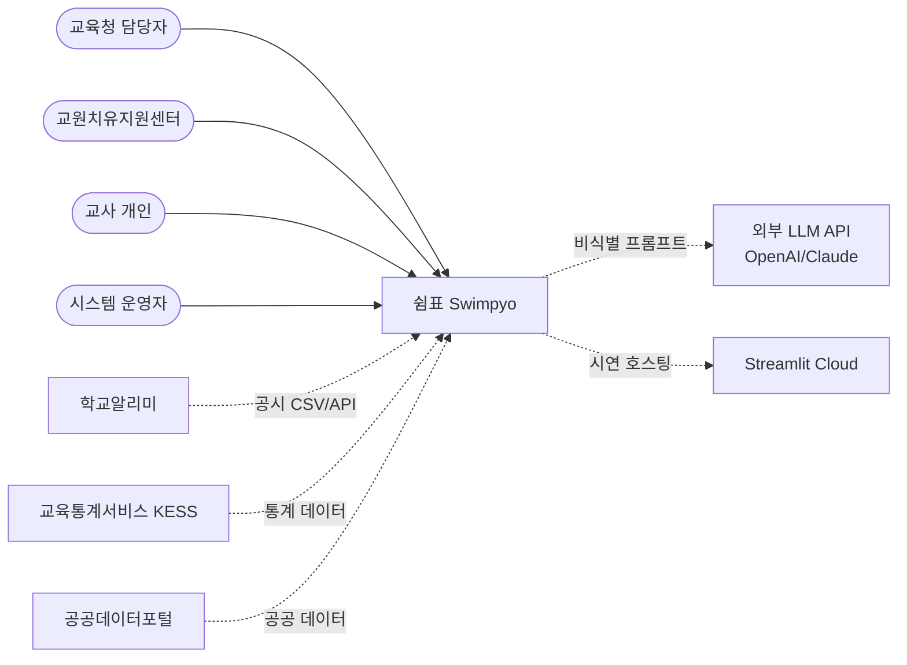

# 아키텍처 스토리: 쉼표(Swimpyo)

> ACAD Stage 1 산출물 — v2 확정본
> 제8회 교육 공공데이터 AI 활용대회 출품작

## 1. 시스템 정의 — "누가, 왜, 무엇을"

> 교사 번아웃을 사후 대응(휴직 신청 후 상담 연결)에서 **선제 예측**으로 전환하기 위해, 학교 단위 공공데이터를 분석하여 "어떤 학교의 어떤 조건에서 교사가 번아웃 위험에 놓이는가"를 예측·시각화하는 AI 시스템

- **주요 사용자**: 교육청 교원복지 담당자(1차), 교원치유지원센터(2차), 교사 개인(3차)
- **핵심 가치**:
  - 교육청: 데이터 기반으로 위험 학교를 선제 식별하고 자원 배분 근거 확보
  - 지원센터: 위험 학교 대상 선제 아웃리치 + 지원 프로그램 수요 예측
  - 교사: 익명으로 자기 학교 환경의 구조적 위험도를 객관적으로 인식, 도움 요청 진입장벽 제거

## 2. 시스템 범위

### In-Scope

- **데이터 수집·융합**: 학교알리미·교육통계·공공데이터포털의 학교 단위 공시 데이터를 학교 코드 기준으로 통합
- **TBRI 예측 모델**: XGBoost/LightGBM 기반 교사 질병휴직률 예측 → 0~100 점수 + 녹/황/적 등급
- **SHAP 기반 위험 요인 설명**: 학교별 위험 원인 Top N 식별
- **관리자 대시보드** (5종)
  - A1. 전국 위험 지도 (Choropleth)
  - A2. 학교별 TBRI 상세 리포트 + SHAP 차트
  - A3. What-if 시뮬레이터
  - A4. 지원 자원 매칭 패널
  - A5. PDF 보고서 자동 생성
- **교사 셀프체크 웹앱** (4종)
  - B1. 학교 조건 5개 항목 입력
  - B2. TBRI 결과·SHAP 위험요인 시각화
  - B3. 맞춤 지원 프로그램 안내
  - B4. 익명 상담 예약/연결 (※ 가정사항 A3 검증 필요)
- **LLM 기반 맞춤 안내 메시지 생성** (외부 LLM, 비식별 프롬프트)
- **서비스 안내 챗봇** (외부 LLM 기반)
  - 범위: 서비스 사용법 + 결과 해석 + 지원 프로그램 안내
  - 배치: 관리자 대시보드 + 교사 셀프체크 양쪽에 동일 컴포넌트
  - 대화 방식: 세션 내 멀티턴, DB 저장 없음
  - 범위 밖 질문(상담·심리 영역)은 정중히 회피하며 전문 채널 안내

### Out-of-Scope

- 개인 교사 식별 데이터 수집·저장
- NEIS·교육행정정보시스템 연동 (실배포 단계로 이연)
- 모바일 네이티브 앱
- 실제 상담사 1:1 매칭 워크플로
- 사용자 회원가입·로그인 시스템 (관리자 영역만 단순 인증, 교사 영역 무인증)
- 인과 추론 (조건부 예측만 주장)
- 챗봇의 상담·심리 영역 답변 (책임 범위 밖, 전문가 채널로 안내)
- 챗봇 대화 이력의 영구 저장 (프라이버시 원칙)
- 로컬 LLM 자체 호스팅 (인프라 제약상 MVP 불가)

### 컨텍스트 다이어그램

## 3. 핵심 시나리오

### 기능 시나리오

| # | 역할 | 시나리오 | 핵심 품질 속성 |
|---|------|---------|--------------|
| S1 | 교육청 담당자 | 전국 위험 지도에서 적색 학교 클릭 → TBRI·SHAP 확인 → What-if 시뮬레이션 → 지원 자원 매칭 → PDF 다운로드 | 사용편의성, 성능 |
| S2 | 교사 개인 | 무인증 접속 → 학교 조건 5개 입력(30초) → TBRI·위험요인 확인 → 맞춤 지원 안내 열람 | 사용편의성, 보안(익명성) |
| S3 | 교원치유지원센터 | 관리자 대시보드에서 지역 내 위험 학교 목록 확인 → 지원 수요 예측 → 선제 아웃리치 대상 선정 | 사용편의성 |
| S4 | 교사 개인 | 셀프체크 후 익명 상담 예약 (PII 미수집) | 보안(프라이버시) |
| S5 | 시스템 운영자 | 공시 데이터 갱신 시점에 ETL 배치 → 모델 재학습 → TBRI 재계산 → 대시보드 갱신 | 변경용이성 |
| S6 | 심사위원 | 대회 시연 중 50명 동시 접속에서 무중단으로 위험 지도·시뮬레이터 시연 | 가용성, 성능 |
| S7 | 교사 또는 교육청 담당자 | 서비스 이용 중 "TBRI 점수가 70이면 어떤 의미죠?" 같은 질문을 챗봇에 입력 → 챗봇이 서비스 안내 범위 내에서 답변 | 사용편의성, 보안 |

### 비기능 요구사항 초안

| 품질 속성 | 기대 수준 | 근거 시나리오 |
|---------|----------|------------|
| 성능 | 50명 동시 접속 시 95%의 페이지 3초 이내 로딩, What-if 1초 이내, 챗봇 응답 첫 토큰 2초 이내 | S1, S6, S7 |
| 가용성 | 대회 시연(2시간) 무중단(100%), 평시 99% | S6 |
| 보안 | 셀프체크 PII 미수집·미저장, LLM 연동 시 식별 정보 비전송, 챗봇 대화 DB 미저장, HTTPS 강제 | S2, S4, S7 |
| 사용편의성 | 셀프체크 30초 이내 완료, 관리자 대시보드 학습 30분 이내, 챗봇 응답이 서비스 범위 내에서 일관되게 답변 | S1, S2, S7 |
| 변경용이성 | 모델 재학습 시 대시보드 코드 수정 없이 반영, 데이터 갱신 시 1시간 내 ETL 완료 | S5 |
| 테스트용이성 | 모델·대시보드·ETL이 독립 단위 테스트 가능 | (운영 요구) |

## 4. 제약사항 & 가정사항

### 확정된 제약

- **기술**: Python 생태계, Streamlit 프론트엔드, 무료 호스팅 (Streamlit Cloud)
- **팀**: 2명, 인프라 전담 없음
- **일정**: MVP **2주 내 시연** ⚠️
- **운영**: 대회 후 지속 운영 의도 (저비용·저운영 구조 필수)
- **데이터**: 공시 데이터만, 갱신 연 1~2회 배치
- **법규**: 개인정보보호법 — 익명 상담·LLM 연동에서 PII 차단 필요

### 가정사항 ⚠️

- **A1. 데이터 확보**: 학교알리미·KESS에서 학교 단위 핵심 변수가 학교 코드 기준 정상 조인되며 결측이 학습 가능 수준 — 검증: Phase 1 1주차
- **A2. LLM 메시지 생성 비식별성**: 맞춤 안내 메시지 생성 시 외부 LLM(OpenAI/Claude)에 학교명·지역명 등 식별 정보를 보내지 않고 위험 요인·자원 코드만 전송해도 자연스러운 안내문이 생성된다 — 검증: Phase 4 보안 검토
- **A3. 익명 상담 예약 보안**: 익명 상담 예약을 PII 저장 없이 구현 가능 (일회성 토큰·외부 폼 리다이렉트 등) — 검증 실패 시 Out-of-Scope로 이동
- **A4. 호스팅 부하**: Streamlit Cloud 무료 티어가 50명 동시 접속·ML 추론·LLM 호출 부하 감당 — 검증: Phase 5 부하 테스트
- **A5. 모델 신뢰성**: 학교 단위 패널 데이터로 학습한 모델이 교육청을 설득할 예측 성능(예: AUC 0.75 이상) — 검증: Phase 3 모델링
- **A6. 챗봇 범위 통제 가능성**: 시스템 프롬프트·가드레일로 챗봇이 서비스 안내 범위만 답하고, 사용자가 PII를 입력해도 응답에 반영하지 않으며, 상담·심리 질문은 전문 채널로 안내한다 — 검증: Phase 4 시스템 프롬프트 적대적 테스트(20개 회피 케이스)
- **A7. LLM 비용·쿼터**: OpenAI/Claude API 무료 크레딧 또는 저비용 모델(GPT-4o-mini·Haiku 등)로 시연·평시 운영 비용을 감당 — 검증: 모델·예산 사전 산정

## 5. 미래 방향

- 시도교육청별 멀티테넌트 분리 운영
- NEIS·교원능력개발평가 시스템 연동
- 모바일 PWA → 네이티브
- 실제 상담사 매칭 워크플로 연계
- 시계열 예측(향후 1년 위험도 변화)
- 챗봇 RAG 도입 (FAQ·매뉴얼·지원 프로그램 DB 검색 기반 응답)
