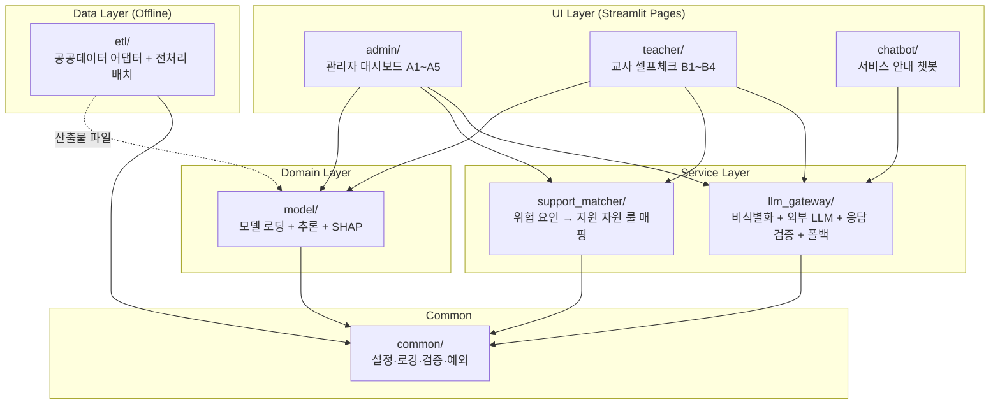
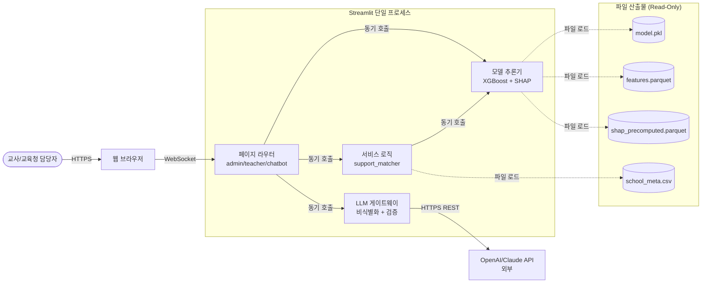
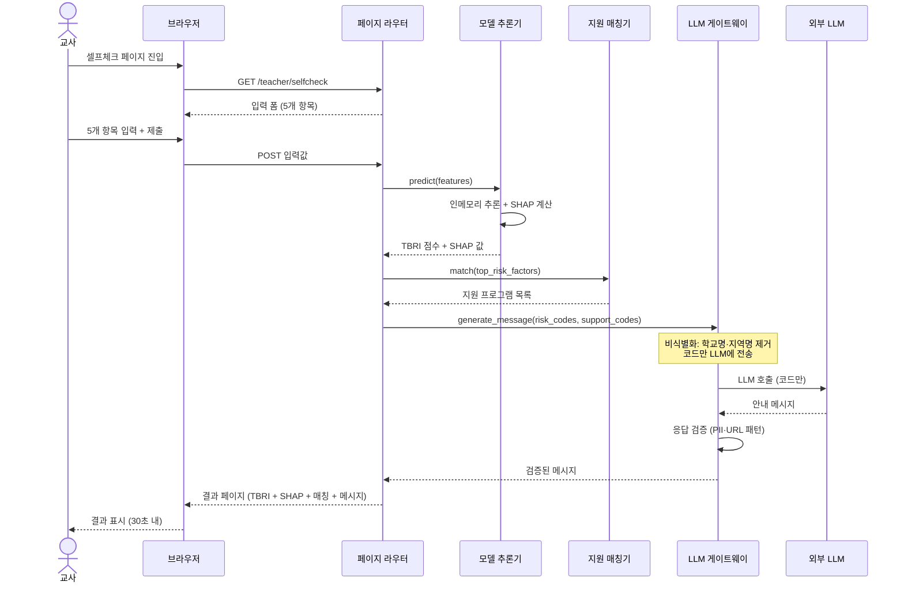
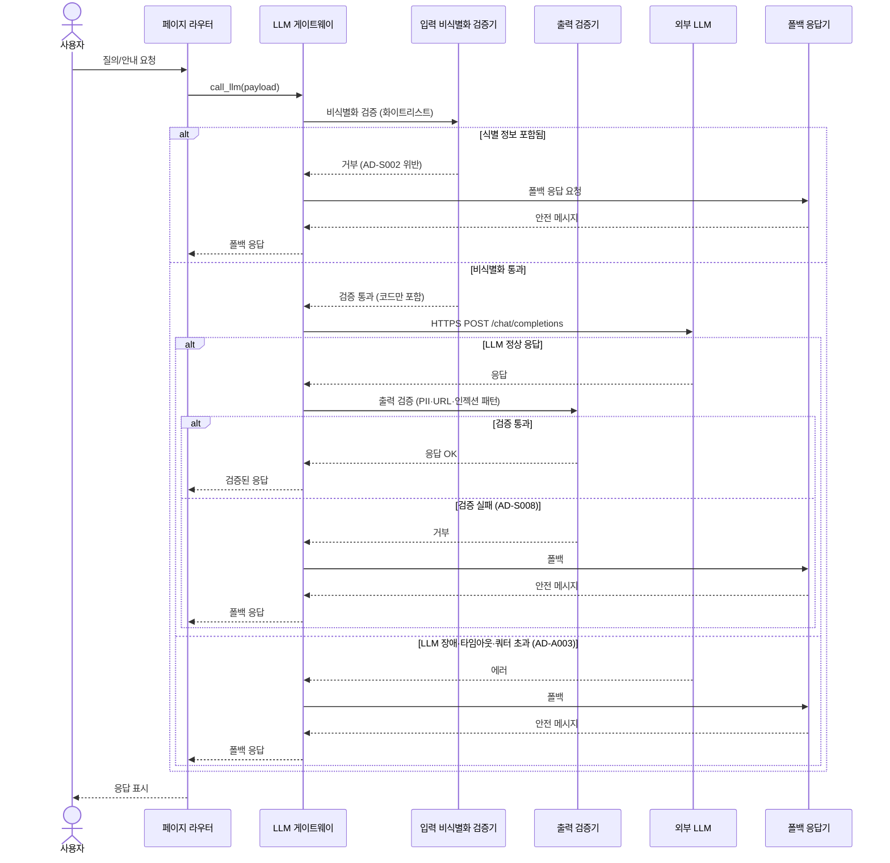
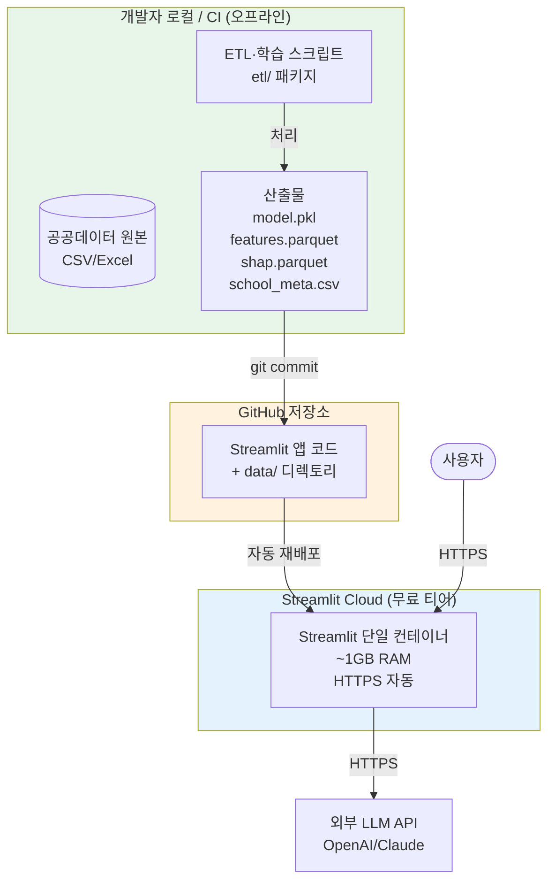

# 아키텍처: 쉼표(Swimpyo)

> ACAD Stage 3 산출물 — 확정본
> 입력: arch-story.md, architecture-drivers.md
> 산출 일자: 2026-05-21
> 상태: 확정 (Stage 4 진행 가능)

---

## 1. 아키텍처 스타일·패턴 후보 비교 평가 (ATAM 기반)

> 상세 분석은 `stage3-candidates-review.md` 참조. 아래는 요약과 결론.

### 후보 요약

| 후보 | 한 줄 정의 | hard constraint 충족 | 결론 |
|------|---------|------------------|------|
| **후보 1: 모듈러 모놀리스 + 파일 산출물** | 모든 런타임을 단일 Streamlit 프로세스에 모듈로 묶고 ETL·학습은 오프라인 배치 산출물로 결합 | AD-CON001·002·004·006 모두 ●●● | **채택** |
| 후보 2: Streamlit + FastAPI 분리 | UI는 Streamlit, 추론·LLM 게이트는 FastAPI로 분리 | AD-CON001 ●○○ / AD-CON002 ●○○ / AD-CON004 ●○○ | 배제 |
| 후보 3: Streamlit + 서버리스 함수 | UI는 Streamlit, 무거운 작업은 Lambda/Cloud Functions | AD-CON001 ●○○ / AD-CON002 ●○○ / AD-CON006 ●●○ | 배제 |

### 배제 근거

**후보 2(FastAPI 분리)**: Streamlit Cloud 무료 티어로 두 서비스 호스팅 불가 → 별도 호스팅 비용 발생. 두 서비스 운영은 2주 MVP·팀 2명 제약 위반.

**후보 3(서버리스)**: 콜드 스타트로 AD-U001(셀프체크 30초) 위협, 멀티 클라우드 운영 부담, Streamlit ↔ Lambda 통신·인증·시크릿 추가 학습 필요.

### ATAM 평가 요약 (P0 드라이버 기준)

| P0 드라이버 | 후보 1 | 후보 2 | 후보 3 |
|-----------|:----:|:----:|:----:|
| AD-A001 시연 무중단 | ●●○ | ●●● | ●●○ |
| AD-A003 LLM 장애 폴백 | ●●● | ●●● | ●●● |
| AD-S001 PII 영구 저장 0건 | ●●● | ●●● | ●●● |
| AD-S002 LLM 식별 정보 차단 | ●●● | ●●● | ●●● |
| AD-S003 HTTPS 강제 | ●●● | ●●○ | ●●○ |
| AD-U001 셀프체크 30초 | ●●● | ●●○ | ●○○ |

→ 후보 1이 hard constraint와 P0 드라이버를 모두 만족하는 **사실상 유일한 현실적 선택**. 팀 검토 완료(2026-05-21).

---

## 2. 최종 선택 + 트레이드오프

### 최종 선택

**후보 1: 모듈러 모놀리스 + 파일 기반 산출물 (단일 Streamlit 앱)**

핵심 컴포넌트:
- 단일 Streamlit 앱 (관리자 / 교사 셀프체크 / 챗봇 페이지 분리)
- 인메모리 모델 로딩 (XGBoost/LightGBM + SHAP 사전 계산값)
- **외부 LLM 게이트웨이 모듈** (비식별화 + 폴백 + 응답 검증)
- 공공데이터 어댑터 + 통합 ETL (오프라인 배치, 런타임 분리)
- 파일 산출물: 모델 pickle, Parquet/CSV, SHAP 사전계산값, 학교 메타데이터

### 감수 트레이드오프

#### TO-1. 단일 프로세스 SPOF
- **위협**: 한 모듈 예외 → 전체 앱 다운 (AD-A001 위협)
- **완화**:
  - LLM 게이트웨이를 `try/except` + 폴백 응답으로 격리
  - SHAP 계산 실패 시 TBRI 점수만 표시하는 degraded mode 지원
  - Streamlit Cloud 자동 재시작 의존
- **잔존 위험**: 메모리 누수·OOM은 자동 복구 불가 → Stage 4 부하 테스트 필요

#### TO-2. 백그라운드 워커 부재
- **위협**: 앱 내부에서 ETL·재학습 실행 불가 (AD-F005)
- **완화**:
  - ETL·학습은 별도 로컬/CI 스크립트로 오프라인 실행
  - 산출물(`model.pkl`, `features.parquet`, `shap_values.parquet`)을 저장소에 커밋 → Streamlit Cloud 자동 재배포
  - 연 1~2회 갱신(AD-CON005)이라 수동 트리거 허용

#### TO-3. 향후 확장 분리 비용
- **위협**: 트래픽 증가·기능 분리 필요 시 모놀리스 분해 비용 (AD-C001)
- **완화**:
  - 패키지 경계 분명히: `admin/ teacher/ chatbot/ llm_gateway/ model/ etl/ common/`
  - 의존성 방향 강제: UI → service → model 단방향
  - `llm_gateway`, `model`을 향후 FastAPI 서비스로 추출 가능한 형태로 설계
- **잔존 위험**: 분리 시점에 일정 비용 불가피 → Stage 4에서 트래픽 임계치 사전 정의

#### TO-4. 보안 경계 단일화 (UI ↔ LLM 게이트 동일 프로세스)
- **위협**: 비식별화 게이트를 UI와 같은 런타임에서 우회 시 영향 큼 (AD-S002)
- **완화**:
  - LLM 호출을 `llm_gateway.call_llm()` 단일 진입점으로만 허용
  - PII 차단을 **2중 방어**: ① 화이트리스트(허용 필드만 전송) ② 패턴 정규식 사전 차단
  - 단위 테스트에서 우회 시도 케이스(직접 OpenAI SDK 호출 등)를 fail로 검증

### 비-수렴 후보 보존

- 후보 2(FastAPI 분리)는 **Phase 2(대회 후 트래픽 증가)** 시 자연스러운 진화 경로
- TO-3 완화 전략으로 모듈 경계를 미리 마련해두어 추출 비용 최소화

---

## 3. 뷰 선택 (CMU 3 View)

| 뷰 | 그릴 것인가 | 이유 |
|----|:--------:|------|
| **Module 뷰** | ✅ Level 2 | TO-3 미래 분리 대비 — 모듈 경계와 의존 방향을 코드 구조로 명시 |
| **C&C 뷰** | ✅ 컴포넌트 + 시퀀스 2개 | 셀프체크 흐름(AD-U001)·LLM 게이트 흐름(AD-S002·S005·S008) 가시화 |
| **Allocation 뷰** | ✅ 단일 서버 형태 | Streamlit Cloud 무료 티어(AD-CON004) 충족 명시 |

**다이어그램 도구**: Mermaid (arch-story.md와 일관성, GitHub·Streamlit 네이티브 렌더링)

---

## 4. 뷰 다이어그램

### 4-1. Module 뷰 (Level 2)

#### 패키지 책임

| 패키지 | 책임 | 비고 |
|--------|------|------|
| `admin/` | 관리자 대시보드 5종(A1~A5) Streamlit 페이지 | UI Layer |
| `teacher/` | 교사 셀프체크 4종(B1~B4) Streamlit 페이지 | UI Layer, 무인증 |
| `chatbot/` | 서비스 안내 챗봇, 시스템 프롬프트·가드레일 | admin·teacher 양쪽 임베드 |
| `llm_gateway/` | **외부 LLM 호출의 유일한 진입점** — 비식별화·호출·응답 검증·폴백 | AD-S002·S005·S008 책임 |
| `support_matcher/` | 위험 요인 코드 → 지원 프로그램·기관 룰 매핑 | LLM 호출 없음 |
| `model/` | 모델 pickle 로딩, 추론, SHAP 계산, TBRI 정규화 | 인메모리 |
| `etl/` | 학교알리미·KESS·공공데이터포털 어댑터, 전처리 배치 | **오프라인 전용** |
| `common/` | 설정·로깅·검증·예외 정의 | 모든 패키지 의존 가능 |

#### 의존성 규칙

- **단방향 의존**: UI → Service → Domain → Common (역방향 import 금지)
- **LLM 호출 단일 진입점**: `llm_gateway.call_llm()` 외 경로 차단
- **ETL은 런타임 분리**: `etl/`은 Streamlit 앱에서 import 금지, 산출물 파일로만 결합
- **테스트 격리**: 각 패키지는 외부 의존성을 인터페이스로 추상화 (AD-T001)

---

### 4-2. C&C 뷰 — 컴포넌트 다이어그램

**커넥터 타입**:
- `HTTPS`: 사용자 ↔ Streamlit Cloud, Streamlit ↔ LLM API (모두 TLS 강제)
- `WebSocket`: Streamlit 기본 통신 (브라우저 ↔ 서버)
- `동기 호출`: 프로세스 내부 모듈 간 함수 호출
- `파일 로드`: 프로세스 시작 시 1회 + `@st.cache_data`로 메모리 캐싱

---

### 4-3. C&C 뷰 — 시퀀스 1: 교사 셀프체크 흐름 (AD-U001 검증)

**핵심 ASR 추적**:
- AD-U001 (30초 이내): 추론·매칭은 인메모리, LLM만 외부 호출 1회
- AD-F007 (SHAP 동봉): 추론과 SHAP을 한 묶음으로 처리
- AD-S001 (PII 미저장): 입력값은 응답 후 메모리에서 사라짐, DB 미사용

---

### 4-4. C&C 뷰 — 시퀀스 2: LLM 호출 흐름 (AD-S002·S005·S008 검증)

**핵심 ASR 추적**:
- AD-S002: 비식별화 검증기에서 화이트리스트 외 필드 차단
- AD-S005: 챗봇 인젝션 시도는 시스템 프롬프트 + 출력 검증으로 회피
- AD-S008: 출력 검증기에서 PII·URL·악성 패턴 차단
- AD-A003: LLM 장애·타임아웃·쿼터 시 폴백 응답으로 핵심 기능 유지

---

### 4-5. Allocation 뷰

**환경 매핑**:

| 소프트웨어 요소 | 환경 | 비고 |
|------------|------|------|
| `etl/` (배치 스크립트) | 개발자 로컬 / GitHub Actions | 연 1~2회 수동 또는 CI 트리거 |
| `model.pkl`, `*.parquet` 등 산출물 | Git 저장소 → Streamlit Cloud | 데이터 갱신 = 산출물 커밋 |
| `admin/`, `teacher/`, `chatbot/`, `llm_gateway/`, `model/`, `support_matcher/` | Streamlit Cloud 단일 컨테이너 | 무료 티어 ~1GB RAM 한도 |
| 외부 LLM 호출 | Streamlit Cloud → OpenAI/Claude (HTTPS) | API 키는 Streamlit secrets |

**네트워크 토폴로지**: Streamlit Cloud가 HTTPS·도메인을 매니지드로 제공하므로 별도 VPC·DMZ 설계 없음. AD-S003 충족은 Streamlit Cloud 기본 동작에 의존.

**자원 한도 검증**:
- 메모리: XGBoost 모델 ~50MB + 학습 데이터 ~100MB + Streamlit 런타임 ~300MB ≈ 450MB < 1GB ✓
- 동시 접속: AD-A001에서 50명 동시 접속 가정 → 가정사항 A4 검증 필요 (Stage 4 부하 테스트)

---

## 5. 기술 스택

> ⚠️ 기술 스택은 Stage 4 아키텍처 검증 완료 후 확정한다.
> ASR 달성 검증 → 리스크 분석 → ADR → 기술 스택 확정 순서.

**잠정 후보** (Stage 4에서 검증):

| 계층 | 잠정 기술 | 관련 ASR |
|------|---------|---------|
| 프론트엔드 | Streamlit | AD-CON003 |
| 모델 | XGBoost 또는 LightGBM | AD-F004·F007 |
| 설명가능 AI | SHAP | AD-F007 |
| 데이터 처리 | pandas, numpy | AD-F006 |
| 지도 시각화 | Folium 또는 Plotly choropleth | AD-F006 |
| 차트 | Plotly | AD-P002 |
| LLM | OpenAI GPT-4o-mini 또는 Claude Haiku | AD-S002·CON008 |
| 호스팅 | Streamlit Cloud | AD-CON004·CON006 |
| 산출물 포맷 | Parquet (대용량) / CSV (메타) / pickle (모델) | AD-F005 |

---

## 6. Stage 4 진입 인계 사항

다음 항목을 Stage 4(검증)에서 검증·확정한다:

1. **AD-A001 달성**: 단일 프로세스 SPOF 완화 전술이 실제 시연 무중단을 보장하는가
2. **AD-U001 달성**: 30초 이내 완료를 위한 인메모리 추론 전술의 충분성
3. **AD-S002 달성**: 비식별화 게이트의 우회 가능성과 화이트리스트·정규식 2중 방어 효과
4. **AD-A003 달성**: LLM 폴백 패턴이 모든 장애 시나리오를 커버하는가
5. **가정 A4 검증**: Streamlit Cloud 무료 티어 50명 동시 접속 처리 가능성
6. **기술 스택 확정**: 위 잠정 후보를 ASR 달성 가능성·리스크 분석 후 확정
