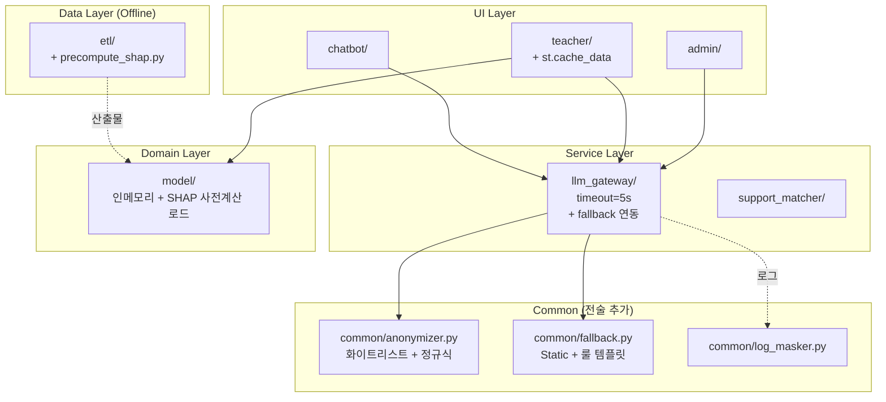

# 아키텍처 검증 보고서: 쉼표(Swimpyo)

> ACAD Stage 4 산출물 — 경량 ATAM 기반 검증
> 입력: arch-story.md, architecture-drivers.md, architecture.md
> 산출 일자: 2026-05-21
> 상태: ✅ 조건부 승인 (가정사항 A4 부하 검증 시 정식 승인)

---

## 1. 유틸리티 트리 (Quality Attribute Utility Tree)

> Stage 2 ASR을 유틸리티 트리 시나리오 레벨로 매핑.
> 시나리오는 외부 관점(black box)으로 기술. 내부 구현(Redis·FastAPI 등)은 시나리오에 등장하지 않는다.

### 가용성 (Availability)
- **AD-A001 시연 무중단** — (H, M)
  - 시나리오: "대회 시연 약 2시간 동안 약 50명의 심사위원·관객이 핵심 기능(지도·TBRI·SHAP·What-if·PDF)을 동시에 이용할 때, 쉼표 시스템은 무중단으로 응답하며 다운타임은 0초여야 한다."
- **AD-A003 LLM 장애 폴백** — (H, M)
  - 시나리오: "외부 LLM API가 장애·지연·쿼터 초과 상태일 때, 쉼표 시스템은 핵심 기능(지도·TBRI·SHAP·What-if·PDF)을 정상 동작시키고 LLM 영역에는 폴백 메시지를 5초 이내 표시해야 한다."

### 보안 (Security)
- **AD-S001 PII 영구 저장 0건** — (H, L)
  - 시나리오: "교사가 셀프체크 5개 항목을 입력하거나 챗봇과 대화할 때, 쉼표 시스템은 응답 직후 입력값을 휘발성 메모리에서 삭제하며 영구 저장소(DB·로그·파일)에는 0건이 기록되어야 한다."
- **AD-S002 LLM 식별 정보 차단** — (H, H)
  - 시나리오: "쉼표 시스템이 외부 LLM API에 프롬프트를 전송할 때, 학교명·지역명·교사 식별 정보는 0건 포함되어야 하며 위험 요인·자원 코드만 포함되어야 한다 (전송 직전 검증)."
- **AD-S003 HTTPS 강제** — (H, L)
  - 시나리오: "사용자가 HTTP로 쉼표에 접근할 때, 100% 자동으로 HTTPS로 리다이렉트되어야 한다."

### 사용편의성 (Usability)
- **AD-U001 셀프체크 30초** — (H, M)
  - 시나리오: "교사가 셀프체크 페이지에 진입해 5개 항목을 입력하고 결과를 확인할 때까지의 시간은 30초 이내여야 하며 입력 단계는 4단계 이하여야 한다."

### 성능 (Performance) — P1 그룹
- AD-P001~P003: 페이지 P95 3초, What-if 1초, 챗봇 첫 토큰 2초

### 6요소 확인 (Top 시나리오만)

**AD-A001**

| 요소 | 내용 |
|------|------|
| 자극원 | 약 50명의 동시 사용자 (심사위원·관객) |
| 자극 | 동시 접속 후 핵심 기능 요청 |
| 환경 | 대회 시연 약 2시간 |
| 아티팩트 | 쉼표 시스템 (전체) |
| 반응 | 무중단 응답 |
| 측정 기준 | 다운타임 0초 |

**AD-U001**

| 요소 | 내용 |
|------|------|
| 자극원 | 익명 교사 |
| 자극 | 셀프체크 5개 항목 입력·제출 |
| 환경 | 모바일 또는 데스크톱 브라우저 |
| 아티팩트 | 쉼표 시스템 (셀프체크 영역) |
| 반응 | 입력 → 결과 표시 완료 |
| 측정 기준 | 진입 ~ 결과 확인 30초 이내, 4단계 이하 |

**AD-S002**

| 요소 | 내용 |
|------|------|
| 자극원 | 셀프체크 또는 챗봇 호출 흐름 |
| 자극 | LLM 호출 발생 |
| 환경 | 운영 중 (정상·악의적 입력 모두 포함) |
| 아티팩트 | 쉼표 시스템 (LLM 게이트웨이) |
| 반응 | 식별 정보 필터링 후 LLM 전송 |
| 측정 기준 | LLM에 전송된 프롬프트 내 학교명·지역명·교사 식별 정보 0건 |

---

## 2. Top 시나리오 (분석 우선순위)

| 순위 | ASR ID | 품질 속성 | 우선순위 | 선정 이유 |
|------|--------|---------|:------:|---------|
| 1 | AD-S002 | 보안 (식별 정보 차단) | (H, H) | 미달 시 개인정보보호법 위반, 시스템 출시 불가. 비식별화 게이트 설계 자체가 어려움 |
| 2 | AD-A001 | 가용성 (시연 무중단) | (H, M) | 대회 시연 자체가 미달 시 평가 실패. SPOF 완화 필요 |
| 3 | AD-A003 | 가용성 (LLM 폴백) | (H, M) | LLM 외부 의존을 안고 있어 시연 직전 발생 가능성 높음 |
| 4 | AD-U001 | 사용편의성 (30초) | (H, M) | 교사 영역 핵심 가치. 미달 시 사용자 진입 장벽 |
| 5 | AD-S001 | 보안 (PII 미저장) | (H, L) | 미달 시 법적 책임. 단 구현 난이도는 낮음 (DB 미사용으로 자연 달성) |

---

## 3. 시나리오별 아키텍처 접근법 분석

### 3-1. AD-S002 — LLM 식별 정보 차단 (Top 1)

**현재 아키텍처 접근법**: 화이트리스트 기반 비식별화 게이트(`llm_gateway/`)에서 위험 요인 코드·자원 코드만 LLM에 전송

**대안 전술 후보**:

| 후보 | 설명 | 장점 | 단점 |
|------|------|------|------|
| **T-A** 화이트리스트 + 정규식 2중 방어 | 허용 필드 명시 + 학교명·전화·주민번호 패턴 사전 차단 | 우회 방어 강함, 단순 | 화이트리스트 누락 시 시야 밖 |
| T-B 블랙리스트 정규식 단독 | PII 패턴만 차단 | 구현 단순 | 새로운 패턴 누락 위험 |
| T-C 외부 비식별화 서비스 위탁 | AWS Macie 등 | 검증력 높음 | 비용·일정 위반 (AD-CON002·006) |
| T-D 로컬 LLM 자체 호스팅 | 외부 전송 자체 차단 | 근본 해결 | 인프라 제약 위반 (AD-CON004) |

**ASR 충돌 검토**:

| | T-A 선택 | T-B 선택 | T-C 선택 | T-D 선택 |
|---|:---:|:---:|:---:|:---:|
| AD-S002 비식별화 | ✅ | ⚠️ | ✅ | ✅ |
| AD-CON002 2주 MVP | ✅ | ✅ | ❌ | ❌ |
| AD-CON004 무료 호스팅 | ✅ | ✅ | ❌ | ❌ |
| AD-CON008 LLM 비용 | ✅ | ✅ | ⚠️ | ✅ |

**선택**: **T-A 화이트리스트 + 정규식 2중 방어**

| 항목 | 내용 |
|------|------|
| **민감점** | 화이트리스트 정의의 완전성에 강하게 의존. 새 필드 추가 시 화이트리스트 업데이트 누락 가능 |
| **트레이드오프 포인트** | 화이트리스트로 인해 LLM이 받는 컨텍스트가 제한 → 응답 자연스러움 ↓ (AD-U003에 영향) |
| **리스크** | R-004 화이트리스트 우회. 새 필드가 화이트리스트에 없는 채로 전달되면 PII 유출 가능 |
| **비리스크** | 정규식은 핵심 PII 패턴(전화번호·이메일·주민번호)을 항상 검사하므로 알려진 패턴은 안전 |

---

### 3-2. AD-A001 — 시연 무중단 (Top 2)

**현재 아키텍처 접근법**: 단일 프로세스(모듈러 모놀리스) + 모듈 격리(try/except) + Streamlit Cloud 자동 재시작 의존

**대안 전술 후보**:

| 후보 | 설명 | 장점 | 단점 |
|------|------|------|------|
| **T-A** 모듈 격리 + 자동 재시작 | 각 모듈 try/except + Streamlit Cloud 헬스체크 | 단순, 비용 0 | 메모리 누수에 무력 |
| T-B 액티브-스탠바이 이중화 | Streamlit Cloud 2개 인스턴스 + DNS 페일오버 | 무중단 강함 | 무료 티어 위반 (CON004) |
| T-C 사전 부하 테스트 + 메모리 모니터링 | locust로 50명 동시 시뮬레이션 + Streamlit Cloud 메트릭 확인 | 사전 감지 | 시연 중 실시간 보호 X |

**선택**: **T-A + T-C 병용** — 모듈 격리 + 자동 재시작 + 사전 부하 테스트

| 항목 | 내용 |
|------|------|
| **민감점** | Streamlit Cloud 무료 티어 메모리 한도(~1GB) 및 자동 재시작 SLA |
| **트레이드오프 포인트** | 이중화 포기 → 비용 0 유지 / 단일 프로세스 SPOF 잔존 |
| **리스크** | R-001 메모리 누수·OOM 시 자동 재시작이 시연 중 발생 가능 (다운타임 수십 초) |
| **비리스크** | 단일 프로세스 내 try/except로 한 모듈 예외가 전체 다운으로 번지지 않음 |

**전술 추가**: 시연 직전 메모리 워밍업(미리 모든 페이지 1회 로드)·Streamlit 캐시 사전 채움(`@st.cache_data` 트리거).

---

### 3-3. AD-A003 — LLM 장애 폴백 (Top 3)

**현재 아키텍처 접근법**: LLM 게이트웨이에서 타임아웃 + Static Fallback 메시지

**대안 전술 후보**:

| 후보 | 설명 | 장점 | 단점 |
|------|------|------|------|
| **T-A** Timeout + Static Fallback | 5초 타임아웃 + 사전 정의 안내 문구 | 단순, 즉시 동작 | LLM 가치 일시 상실 |
| T-B Circuit Breaker + Retry | 3회 재시도 + 회로 차단 | 일시 장애 복구 | 5초 응답 목표 위반 가능 |
| T-C Local Template Engine 폴백 | 룰 기반 안내문 생성 | LLM 유사 UX | 룰 작성·유지 부담 |
| T-D 캐시된 응답 재사용 | 자주 묻는 패턴 사전 캐싱 | 폴백 자연스러움 | 캐시 키 설계 복잡 |

**선택**: **T-A + T-C 병용** — 단기 장애는 폴백 메시지, 메인 안내는 룰 기반 템플릿으로 LLM 유사 UX 제공

| 항목 | 내용 |
|------|------|
| **민감점** | 폴백 메시지 품질이 LLM 부재 시 UX 좌우 |
| **트레이드오프 포인트** | LLM 자연스러움 ↓ vs 가용성 ↑ |
| **리스크** | R-003 폴백 메시지가 너무 일반적이라 사용자 만족도 저하 (AD-U003 영향) |
| **비리스크** | 핵심 기능(TBRI·SHAP·What-if)은 LLM과 무관하게 동작 |

---

### 3-4. AD-U001 — 셀프체크 30초 (Top 4)

**현재 아키텍처 접근법**: 인메모리 추론 + SHAP 사전계산 + Streamlit `@st.cache_data`

**대안 전술 후보**:

| 후보 | 설명 | 장점 | 단점 |
|------|------|------|------|
| **T-A** 인메모리 + 사전계산 + 캐시 | 모델·SHAP·메타 메모리 로딩, 결과 캐시 | 최단 응답 | 메모리 사용량 ↑ |
| T-B 외부 추론 API | FastAPI 별도 서비스 | 분산 부하 | CON 위반 (이미 후보 3에서 배제) |
| T-C 사전 계산 결과만 표시 (추론 X) | 학교 코드 → 사전 매핑 | 즉시 응답 | What-if 불가 |

**선택**: **T-A** — 인메모리 + 사전계산 + Streamlit 캐시

| 항목 | 내용 |
|------|------|
| **민감점** | 모델 크기와 메모리 한도. 큰 모델은 무료 티어 OOM 유발 |
| **트레이드오프 포인트** | 메모리 사용량 ↑ vs 응답 속도 ↑ (메모리 모니터링으로 균형) |
| **리스크** | R-005 SHAP 사전계산 산출물이 새 데이터에 맞지 않아 추론 시 KeyError. 데이터 갱신 시 검증 누락 가능 |
| **비리스크** | LightGBM은 XGBoost보다 메모리 효율적 → 무료 티어 적합 |

---

### 3-5. AD-S001 — PII 영구 저장 0건 (Top 5)

**현재 아키텍처 접근법**: DB 미사용. 세션 휘발성 메모리만 사용. 로그에는 입력값 마스킹.

**대안 전술 후보**:

| 후보 | 설명 | 장점 | 단점 |
|------|------|------|------|
| **T-A** DB 미사용 + 세션 메모리 + 로그 마스킹 | 가장 단순한 0건 보장 | 구현 최소 | 통계 수집 어려움 |
| T-B 암호화 DB + 자동 만료 | 짧은 TTL로 자동 삭제 | 통계 가능 | 구현 부담, 키 관리 |

**선택**: **T-A** — MVP는 통계 수집보다 0건 보장 우선

| 항목 | 내용 |
|------|------|
| **민감점** | Streamlit 세션 객체가 메모리에 잔존하는 기간 |
| **트레이드오프 포인트** | 분석·통계 데이터 부재 vs 절대적 PII 0건 |
| **리스크** | R-006 (낮음) 실수로 입력값을 `st.session_state`에 영구 저장 시 메모리 잔존 |
| **비리스크** | DB 자체가 없으므로 영구 저장 경로 부재 — 구조적 안전 |

---

## 3-a. 트레이드오프 요약

| 트레이드오프 포인트 | 얻는 것 | 잃는 것 | 관련 ASR |
|-----------------|--------|--------|---------|
| 단일 프로세스 (모놀리스) | 비용·운영 단순화 | 단일 프로세스 SPOF | AD-A001 ↑·↓ / AD-CON001 ↑ |
| 화이트리스트 비식별화 | 보안 강함 | LLM 컨텍스트 제한 → 응답 자연스러움 ↓ | AD-S002 ↑ / AD-U003 ↓ |
| Static + Template Fallback | LLM 장애 시 가용성 | LLM 부재 시 안내 품질 ↓ | AD-A003 ↑ / AD-U003 ↓ |
| 사전계산 + 인메모리 | 응답 속도 ↑ | 메모리 사용량 ↑, OOM 리스크 | AD-U001 ↑·P002 ↑ / AD-A001 ↓ |
| DB 미사용 | PII 0건 구조 보장 | 통계·재방문 분석 불가 | AD-S001 ↑ / 비기능 분석 ↓ |

---

## 3-b. Refined Architecture

### 채택된 전술 목록

| 시나리오 | 선택 전술 | 탈락 전술 | 선택 근거 |
|---------|---------|---------|---------|
| AD-S002 | 화이트리스트 + 정규식 2중 방어 | T-B/T-C/T-D | T-C/D는 일정·비용 위반, T-B는 우회 위험 |
| AD-A001 | 모듈 격리 + 자동 재시작 + 사전 부하 테스트 | T-B (이중화) | 무료 티어 위반 |
| AD-A003 | Timeout + Static Fallback + 룰 기반 템플릿 | T-B (Retry) | 5초 응답 목표 위반 가능성 |
| AD-U001 | 인메모리 + SHAP 사전계산 + `@st.cache_data` | T-B/T-C | T-B는 CON 위반, T-C는 What-if 불가 |
| AD-S001 | DB 미사용 + 세션 메모리 + 로그 마스킹 | T-B (암호화 DB) | MVP 일정 위반 |

### 전술이 반영된 컴포넌트 변경사항

| 변경 유형 | 컴포넌트 | 내용 |
|---------|---------|------|
| 추가 | `common/anonymizer.py` | 화이트리스트 + 정규식 PII 차단 검증기 |
| 추가 | `common/fallback.py` | LLM 폴백 메시지 + 룰 기반 안내문 템플릿 |
| 추가 | `common/log_masker.py` | 로그 출력 시 PII 마스킹 필터 |
| 추가 | `etl/precompute_shap.py` | SHAP 값 배치 사전 계산 스크립트 |
| 변경 | `llm_gateway/call_llm.py` | timeout=5s, retry=0, fallback 연동 |
| 변경 | `teacher/selfcheck.py` | `@st.cache_data` 적용, 입력값을 session_state에 저장하지 않음 |
| 추가 | `tests/test_anonymizer_bypass.py` | 우회 시도 케이스 단위 테스트 |
| 추가 | `tests/test_fallback_quality.py` | 폴백 메시지 품질 검증 |

### Refined Module View (전술 반영)

### Refined C&C 시퀀스 — LLM 호출 (전술 반영)

Stage 3 시퀀스 2와 동일한 구조에 추가:
- `timeout=5s` 명시
- `retry=0` (재시도 없음 — 즉시 폴백)
- 비식별화 검증기 = `common/anonymizer.py` (화이트리스트 + 정규식)
- 폴백 응답기 = `common/fallback.py` (Static 메시지 + 룰 템플릿)

---

## 4. 리스크 등록부

| ID | 리스크 | 관련 ASR | 발생 가능성 | 영향도 | 완화 전략 | 완화 후 가능성 | 구현 복잡도 |
|----|-------|---------|-----------|-------|---------|------------|-----------|
| R-001 | Streamlit 메모리 누수·OOM으로 시연 중 자동 재시작 발생 (다운타임 수십 초) | AD-A001 | 30% | 높음 | ① 시연 전 locust 부하 테스트 ② 모델·데이터 메모리 사용량 측정 ③ LightGBM 채택(메모리 효율) ④ 시연 직전 워밍업 | 10% | 중간 |
| R-002 | Streamlit Cloud 무료 티어가 50명 동시 접속 처리 못함 (가정 A4 미검증) | AD-A001·P001 | 40% | 높음 | ① locust 시뮬레이션으로 가정 A4 검증 ② 실패 시 Hugging Face Spaces 백업 계정 준비 | 15% | 낮음 |
| R-003 | LLM 폴백 메시지가 너무 일반적이라 사용자 만족도 저하 | AD-A003·U003 | 50% | 중간 | ① 룰 기반 템플릿으로 위험 요인별 차등 안내 ② 폴백 품질 단위 테스트 | 25% | 중간 |
| R-004 | 비식별화 화이트리스트 누락 — 새 필드가 화이트리스트에 없는 채로 LLM 전송 | AD-S002 | 20% | 매우 높음 | ① 화이트리스트를 코드 상수로 정의·코드 리뷰 강제 ② 적대적 우회 시도 단위 테스트(직접 LLM SDK 호출 fail) ③ 정규식 2차 방어 | 5% | 낮음 |
| R-005 | SHAP 사전계산 산출물이 새 데이터 스키마와 불일치 → 추론 시 KeyError | AD-F005·U001 | 25% | 중간 | ① `etl/precompute_shap.py`가 스키마 검증 후 산출물 생성 ② 산출물 버전 메타데이터 포함 ③ 앱 시작 시 스키마 검증 실패하면 명확한 에러 메시지 | 8% | 중간 |
| R-006 | 실수로 `st.session_state`에 입력값을 영구 저장 → PII 잔존 | AD-S001 | 15% | 높음 | ① 단위 테스트에서 session_state 키 화이트리스트 검사 ② 코드 리뷰 체크리스트 추가 | 3% | 낮음 |
| R-007 | OpenAI/Claude 무료 크레딧 소진 후 시연 중 호출 실패 | AD-CON008 | 25% | 중간 | ① 시연 전 잔여 크레딧 확인 ② R-003 폴백으로 무관하게 동작 가능 ③ 백업 API 키 준비 | 10% | 낮음 |
| R-008 | 챗봇 인젝션 적대적 케이스 회피율 미달 (목표 100%) | AD-S005 | 30% | 중간 | ① 20개 회피 케이스로 단위 테스트 ② 시스템 프롬프트 강화 ③ 출력 검증기 차단 | 10% | 중간 |

---

## 5. ADR (아키텍처 결정 기록)

### ADR-001: 모듈러 모놀리스 아키텍처 채택
- **상태**: 확정
- **맥락**: 2주 MVP·팀 2명·인프라 전담 없음·무료 호스팅이라는 hard constraint가 있음. 후보 2(FastAPI 분리)·후보 3(서버리스)은 hard constraint 위반
- **결정**: 단일 Streamlit 프로세스에 모든 런타임 모듈을 패키지로 분리하여 동거. ETL은 오프라인 배치로 분리
- **근거**: ATAM 평가에서 P0 드라이버 모두 ●●● 또는 ●●○ 달성. AD-CON001·002·004·006 모두 ●●●
- **결과**:
  - (+) 운영 복잡도 최소화, 비용 0원 유지
  - (+) Streamlit Cloud 자동 배포로 운영 자동화
  - (−) 단일 프로세스 SPOF (R-001 잔존)
  - (−) 향후 확장 시 분리 비용 (TO-3)
- **검토 시점**: 대회 종료 후 트래픽 증가 시 (R-002 발현 시점 또는 6개월 후 중 빠른 시점)

### ADR-002: 외부 LLM(OpenAI GPT-4o-mini)을 비식별 프롬프트로 사용
- **상태**: 확정
- **맥락**: 안내 메시지·챗봇에 자연어 생성 필요. 로컬 LLM 호스팅은 AD-CON004 위반. PII는 외부 전송 금지(AD-S002, 개인정보보호법)
- **결정**: OpenAI GPT-4o-mini를 사용하되, `llm_gateway/` 게이트에서 화이트리스트 + 정규식 2중 방어로 비식별화 후 전송
- **근거**: T-A 전술이 비용·일정·보안 모두 충족. Claude Haiku도 대체 가능 (ADR-003 참조)
- **결과**:
  - (+) 자연어 품질 확보
  - (+) 비용 저렴 (1M tokens ≈ 수 달러)
  - (−) 외부 의존성 (R-007)
  - (−) 화이트리스트 누락 리스크 (R-004)
- **검토 시점**: 무료 크레딧 소진 시 또는 응답 품질 이슈 발생 시

### ADR-003: LLM 장애 시 Static Fallback + 룰 기반 템플릿 병용
- **상태**: 확정
- **맥락**: AD-A003은 LLM 장애 시 핵심 기능 정상 동작 + 폴백 응답 5초 이내 필요
- **결정**:
  - 단기 장애·타임아웃: Static Fallback 메시지 (사전 정의 안내문)
  - 메인 안내: 룰 기반 템플릿이 위험 요인 코드별로 차등 메시지 생성
  - Retry는 0 (즉시 폴백) — 5초 응답 목표 위반 방지
- **근거**: T-A + T-C 병용으로 가용성 ↑, 사용자 만족도 일정 수준 유지
- **결과**:
  - (+) LLM 장애 시 무중단
  - (−) 룰 템플릿 작성 부담 (구현 복잡도 중간)
  - (−) LLM 자연스러움 일시 상실 (R-003)
- **검토 시점**: 룰 템플릿 사용 빈도가 LLM 호출 대비 30%를 초과하면 LLM 안정성 개선 검토

### ADR-004: DB 미사용 + 세션 메모리만 사용 (PII 0건 구조 보장)
- **상태**: 확정
- **맥락**: AD-S001 PII 영구 저장 0건. 개인정보보호법 + 익명성 보장
- **결정**: SQLite·외부 DB 미도입. 모든 입력은 `st.session_state` 휘발성 메모리만 사용. 로그에는 PII 마스킹
- **근거**: T-A 전술이 구조적으로 0건 보장 — DB가 없으므로 영구 저장 경로 부재
- **결과**:
  - (+) 법적 리스크 0
  - (+) 인프라 비용 0
  - (−) 통계·재방문 분석 불가
- **검토 시점**: Phase 2에서 통계 수요 발생 시 — 비식별 집계 DB 도입 검토

### ADR-005: 모델은 LightGBM (vs XGBoost)
- **상태**: 확정
- **맥락**: Streamlit Cloud 무료 티어 ~1GB RAM, 인메모리 추론, 50명 동시 접속
- **결정**: LightGBM 채택 (메모리 효율 + 학습/추론 속도)
- **근거**: 같은 데이터 규모에서 XGBoost 대비 메모리 30~40% 절감(공개 벤치마크). R-001 완화에 직접 기여
- **결과**:
  - (+) 메모리 여유 확보
  - (+) 학습 속도 빠름 → ETL 배치 시간 단축
  - (−) XGBoost 대비 small-data에서 성능 약간 낮을 수 있음
- **검토 시점**: 모델 AUC가 0.75 미달 시 XGBoost·CatBoost 재검토 (가정 A5)

### ADR-006: 데이터 갱신은 산출물 파일 커밋 + 자동 재배포
- **상태**: 확정
- **맥락**: AD-F005 무중단 갱신. AD-CON005 연 1~2회 배치
- **결정**:
  - `etl/`이 오프라인 배치로 산출물(`model.pkl`, `features.parquet`, `shap.parquet`, `school_meta.csv`) 생성
  - Git 저장소에 산출물 커밋 → Streamlit Cloud 자동 재배포
  - 산출물에 스키마 버전 메타데이터 포함
- **근거**: 무료 호스팅·운영 자동화·연 1~2회 갱신 빈도에 적합
- **결과**:
  - (+) 운영 부담 최소
  - (+) Git 이력으로 데이터 변경 추적 가능
  - (−) 산출물 파일 크기가 Git 한도(파일당 100MB)에 근접하면 Git LFS 필요 (R-005 부분 관련)
- **검토 시점**: 산출물 단일 파일이 50MB 초과 시 Git LFS 도입 검토

### ADR-007: 챗봇 가드레일 — 시스템 프롬프트 + 출력 검증 + 적대적 테스트
- **상태**: 확정
- **맥락**: AD-S005 챗봇 인젝션 회피 100%, AD-S008 출력 검증, AD-U003 범위 내 답변
- **결정**:
  - 시스템 프롬프트로 답변 범위 명시 (서비스 안내·결과 해석·지원 프로그램만)
  - 응답 후 PII·URL·악성 패턴 출력 검증
  - 20개 적대적 케이스 단위 테스트 정의
- **근거**: 가드레일 3중(시스템 프롬프트 + 출력 검증 + 테스트)으로 우회 어려움
- **결과**:
  - (+) 범위 외 답변 차단
  - (−) 적대적 케이스 추가 시 테스트 갱신 부담 (R-008)
- **검토 시점**: 챗봇 사용량 데이터 확보 후 (대회 후 1개월) 회피 케이스 보강

---

## 6. 기술 스택 (확정)

| 계층 | 선택 기술 | 관련 ASR | 선택 이유 | 트레이드오프 |
|------|---------|---------|---------|-----------|
| 프론트엔드 | Streamlit | AD-CON003 | 제약 / 빠른 프로토타입 | SPA 분리 불가 |
| 모델 | **LightGBM** | AD-F004·F007·CON004 | 메모리 효율, R-001 완화 (ADR-005) | small-data 성능 약간 양보 |
| 설명가능 AI | SHAP | AD-F007 | 표준 도구, LightGBM 공식 지원 | 계산 비용 → 사전계산으로 완화 |
| 데이터 처리 | pandas, numpy | AD-F006 | 생태계 표준 | 메모리 사용 — Parquet 활용 |
| 산출물 포맷 | Parquet (대용량) + CSV (메타) + pickle (모델) | AD-F005·M001 | 효율적 IO, 버전 관리 가능 | pickle 보안 — 내부 산출물만 |
| 지도 시각화 | Folium | AD-F006 | Streamlit 위젯 지원, 무료 | 대규모 마커는 별도 최적화 |
| 차트 | Plotly | AD-P002 | 인터랙티브, Streamlit 통합 | 번들 크기 |
| LLM | **OpenAI GPT-4o-mini** | AD-S002·CON008 | 저비용, 빠름, 무료 크레딧 (ADR-002) | 외부 의존 — 폴백 ADR-003 |
| 호스팅 | **Streamlit Cloud 무료 티어** | AD-CON004·006 | 비용 0, HTTPS 자동 | ~1GB RAM 한도 (R-001/R-002 리스크) |
| 인증(관리자) | Streamlit `st.secrets` + 단순 ID/PW | AD-S004 | 매뉴얼 운영 충분 | 다중 관리자 시 외부 IDP 필요 |
| 로깅 | Python `logging` + 자체 마스킹 필터 | AD-S001 | 외부 의존 회피 | 분산 분석 불가 |
| 테스트 | pytest | AD-T001 | 표준 | — |
| CI | GitHub Actions | AD-CON001·006 | 무료, Streamlit Cloud 연동 | — |

---

## 7. 검증 결론

**아키텍처 승인 여부**: ⚠️ **조건부 승인**

**조건부 승인 사유**: 가정 A4(Streamlit Cloud 무료 티어 50명 동시 접속 처리 가능성)가 미검증. R-002의 완화 전략(locust 부하 시뮬레이션)이 시연 전 반드시 수행되어야 함

**조건부 승인 시 해결 과제**:
1. **A4 부하 검증** — locust로 50명 동시 시뮬레이션 (담당: 개발 1명, 기한: 시연 1주일 전)
   - 실패 시: Hugging Face Spaces 또는 Render 무료 백업 호스팅 준비
2. **R-001 메모리 측정** — `psutil`로 모델·데이터 로드 시 메모리 사용량 기록 (담당: 개발 1명, 기한: Phase 1 완료 시)
3. **R-004 우회 테스트** — 화이트리스트 우회 시도 5종 단위 테스트 작성 + 모든 PR에서 통과 강제 (담당: 개발 1명, 기한: Phase 1)
4. **R-008 챗봇 적대적 테스트** — 20개 회피 케이스 정의 + 자동 테스트 (담당: 개발 1명, 기한: Phase 1 완료 직전)

**Stage 5(Implementation Plan) 진행을 위한 핵심 인터페이스 목록**:

- `llm_gateway.call_llm(payload: dict) → str` — 외부 LLM 호출의 유일한 진입점. `payload`는 화이트리스트 검증 통과 후 전달
- `model.predict(features: dict) → (tbri_score: float, shap_values: dict)` — 인메모리 추론 + SHAP
- `support_matcher.match(risk_factors: list[str]) → list[SupportProgram]` — 위험 요인 코드 → 지원 자원 룰 매핑
- `common/anonymizer.validate(payload: dict) → ValidationResult` — 화이트리스트 + 정규식 PII 차단
- `common/fallback.get_static_response(context: str) → str` — LLM 장애 시 폴백
- `common/fallback.render_template(risk_codes: list[str], support_codes: list[str]) → str` — 룰 기반 안내문

**산출물 파일 인터페이스**:
- `data/processed/features.parquet` — 학교 단위 피처 (학교코드, 13+ 컬럼)
- `data/processed/shap_precomputed.parquet` — 학교코드 + Top-N 위험 요인 + 기여도
- `data/processed/school_meta.csv` — 학교 메타데이터 (학교코드, 시도, 시군구, 학교급)
- `data/processed/model.pkl` — LightGBM 학습된 모델 (pickle)
- `data/schema_version.json` — 산출물 스키마 버전 (R-005 완화)

다음 단계: **Stage 5 Implementation Plan 작성**
