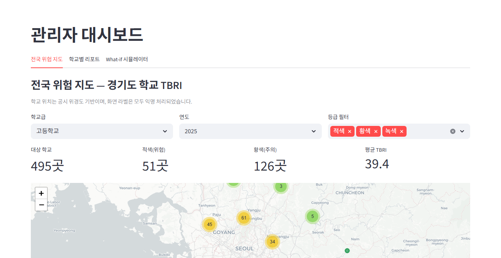
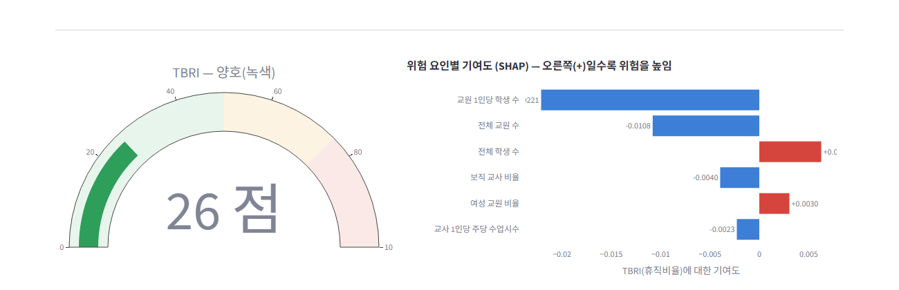

<!-- _paginate: false -->

# 쉼표(Swimpyo)

## AI 기반 교사 업무·감정 부담 **조기경보 시스템**

학교 환경의 구조적 위험을 데이터로 먼저 읽다

**제8회 교육 공공데이터 AI 활용대회 출품작**

- 팀명: **쉼표(Swimpyo)**
- 대상 지역: 경기도교육청 산하 초·중·고

[이미지: 표지 비주얼 — 잎사귀(쉼표) 로고와 위험도 게이지. "사후 대응에서 선제 예측으로" 슬로건]

---

# 활용 교육 공공데이터 및 라이선스

학교알리미(school.go.kr) 공시 6종을 `(학교코드, 연도)` 기준으로 패널 조인 (조인율 100%, 약 9,400 학교×연도)

| # | 데이터셋명 | 출처 / 제공기관 | 기간 | 라이선스 |
|---|----------|----------------|------|--------|
| 1 | 직위별 교원 현황 | 학교알리미 / 교육부·KERIS | 2022~2025 | 공공누리 제1유형 |
| 2 | 수업일수 및 수업시수 현황 | 학교알리미 / 교육부·KERIS | 2022~2025 | 공공누리 제1유형 |
| 3 | 학년별 학급별 학생수 | 학교알리미 / 교육부·KERIS | 2022~2025 | 공공누리 제1유형 |
| 4 | 학생·학부모 상담현황 | 학교알리미 / 교육부·KERIS | 2022~2025 | 공공누리 제1유형 |
| 5 | 동아리 활동현황 | 학교알리미 / 교육부·KERIS | 2022~2025 | 공공누리 제1유형 |
| 6 | 학교기본정보 | 학교알리미 / 교육부·KERIS | 스냅샷 | 공공누리 제1유형 |

**식별정보 처리**: 데이터 로드 직후 학교명·시군구명을 코드로 익명화 → 화면 노출 0건

---

# 문제 인식 — 교사 번아웃, 사후 대응의 한계

[이미지: 좌측 교원 휴직 추이 막대그래프, 우측 "번아웃 → 휴직 → 상담" 사후 대응 흐름도]

### 현 지원 체계는 **사후 대응**에 머물러 있음

- **번아웃 → 휴직 → 상담**의 일방향. 위기 발생 후에야 자원 투입
- 교사 개인의 **심리적 진입장벽** (낙인 우려, 익명성 부재)
- 교육청·지원센터는 **"어느 학교가 위험한가"** 판단할 데이터 근거 부족

### 데이터 기반 **선제 예측 체계는 사실상 전무**

> 휴직률·이직률 같은 결과 지표는 사후 집계만 가능. 학교 단위 **구조적 위험 요인**을 통합 분석한 지수는 공공·민간 어디에도 없음.

---

# 제안 — 학교 '환경'의 구조적 위험을 먼저 읽는 AI

[이미지: 9,400개 학교가 회색 점에서 녹/황/적 3색으로 분류되는 모습, 매개로 LightGBM+SHAP]

### 핵심 아이디어

학교알리미 공시 6종에서 도출한 **15개 구조적 지표**를 LightGBM으로 학습 → **TBRI 점수(0~100)** + SHAP **위험 요인 Top-N** 함께 제시

### 차별점 3가지

1. **학교 단위 구조 분석** — 개인이 아니라 *환경*을 진단 → 자연스러운 익명성
2. **설명가능 AI(SHAP)** — "왜 위험한가"를 요인별 기여도로 분해
3. **What-if 시뮬레이션** — "기간제 2명 배치 시 TBRI는?" 조건부 예측

> 사후 대응을 대체하는 게 아니라, **선제 예측 레이어**를 추가합니다.

---

# 서비스 개요 (1/2) — 관리자 대시보드

**대상**: 교육청 교원복지 담당자 · 교원치유지원센터

| 기능 | 설명 |
|------|------|
| **A1. 전국 위험 지도** | 시군구별 학교를 등급 색(녹/황/적)으로 표시 |
| **A2. 학교별 TBRI 리포트** | 게이지·SHAP 차트·동일 학교급 백분위 |
| **A3. What-if 시뮬레이터** | 조건 조정 → 1초 이내 TBRI 변화 반영 |
| **A4. 지원 자원 매칭** | SHAP 위험 요인 기반 룰 매핑 자동 추천 |

---

# 서비스 개요 (2/2) — 교사 셀프체크

**대상**: 교사 개인 — 로그인·가입 불필요

| 기능 | 설명 |
|------|------|
| **B1. 5개 항목 간편 입력** | 약 30초, 미입력은 학교급 중앙값 자동 채움 |
| **B2. TBRI 결과 확인** | 게이지 + SHAP 위험 요인 시각화 |
| **B3. 맞춤 지원 안내** | 우리 학교 환경에 맞는 지원 프로그램 안내 |
| **B4. 익명성 원칙** | DB 미사용 → **PII 영구 저장 0건 구조 보장** |

---

# AI 활용 과정 (1/3) — pandas 전처리

[이미지: ETL 파이프라인 — 6종 CSV → pandas 전처리(파생변수·결측·이상치·익명화) → features 데이터프레임]

### 6종 CSV → 학교×연도 패널 데이터프레임 통합

| 단계 | 처리 내용 |
|------|---------|
| **로드** | UTF-8-sig CSV를 `glob`로 카테고리별 수집 |
| **조인** | `정보공시 학교코드`×`연도` LEFT JOIN |
| **파생변수** | 휴직·기간제·보직·여교원 비율 등 13종 비율 피처 |
| **결측 처리** | 학교급별 **중앙값**으로 대치 (이상치에 둔감) |
| **이상치** | 비정상 비율(>1)·타깃 결측 행 제거 → 약 9,400 표본 |
| **익명화** | 학교명·지역명을 로드 **직후** 코드 기반 마스킹 |

> 익명화를 데이터 로드 직후 수행 — 이후 화면·로그 어디에도 원본 식별정보 미노출

---

# AI 활용 과정 (2/3) — LightGBM 추론

[이미지: 모델 흐름도 — features → LightGBM 학습 → 예측 휴직비율 → 백분위 환산 → TBRI 점수 → 3단계 등급]

### 모델 선택 — LightGBM (ADR-005)

- **메모리 효율**: XGBoost 대비 30~40% 절감 → 무료 호스팅 적합
- **빠른 추론**: 단일 200ms 이내, What-if 1초 이내
- **SHAP TreeExplainer 공식 지원**

### 학습 구성 · 성능

| 항목 | 값 |
|------|---|
| 타깃 | 휴직비율 (회귀) |
| 입력 피처 | 15개 (수업시수·학급당학생수·기간제비율 등) |
| 하이퍼파라미터 | `n_estimators=400, lr=0.05, num_leaves=31` |
| **회귀 R²** | **≈ 0.51** |
| **분류 AUC** (상위 25% 고위험) | **≈ 0.86** |

> 분류 AUC 0.86 — 고위험 학교 식별력 우수, 실무 활용성 확보

---

# AI 활용 과정 (3/3) — SHAP 설명가능 AI

[이미지: SHAP 주요 변수 분석 차트 — 모델이 도출한 교원 번아웃 영향 요인 3가지(수업시수·학급당학생수·기간제비율)를 가로 막대로 표시. 양수(빨강)=위험 증가, 음수(파랑)=위험 감소]

### 왜 SHAP인가 — "예측"에서 "설명"으로

| 출력 | 의미 |
|------|------|
| SHAP 값 (+) | 해당 요인이 TBRI를 **높이는** 기여 |
| SHAP 값 (−) | 해당 요인이 TBRI를 **낮추는** 기여 |
| 상위 N개 | 절대값 기준 영향력 큰 요인 (개입 우선순위) |

### 룰 기반 지원 자원 매칭

SHAP 상위 위험 요인을 키로 사전 정의 룰에서 지원 프로그램 추천.
**LLM 없이 룰 기반 동작** → 외부 API 장애·비용·PII 리스크에서 자유로움

> 예) "수업시수 위험" → "수업시수 재배분·기간제 배치 우선순위 상향"

---

# 시스템 아키텍처 — 모듈러 모놀리스

[이미지: Module 뷰 다이어그램 — UI(admin/teacher) → Service(llm_gateway/support_matcher) → Domain(model) → Common(anonymizer/fallback). ETL은 산출물 파일로 분리]

### 핵심 결정 (ADR 요약)

| ADR | 결정 |
|-----|------|
| ADR-001 | 모듈러 모놀리스 — 2주 MVP·팀 2명·무료 호스팅 충족 |
| ADR-002 | LLM은 **비식별 프롬프트**만 (개인정보보호법) |
| ADR-003 | LLM 장애 시 **룰 템플릿 폴백** |
| ADR-004 | **DB 미사용** + 세션 휘발 → PII 0건 구조 보장 |
| ADR-005 | **LightGBM** (메모리 효율 + SHAP 지원) |
| ADR-006 | 데이터 갱신 = 산출물 파일 커밋 + 자동 재배포 |

### ATAM 검증 결과 (P0 품질속성)

- ✅ **가용성** — 핵심 기능 외부 의존 없음, 모듈 격리
- ✅ **보안** — 익명화 게이트, DB 미사용, HTTPS 강제
- ✅ **사용편의성** — 셀프체크 30초·5단계 이내

---

# 프로토타입 구현 결과

[이미지: 좌측 관리자 대시보드(위험 지도+TOP 15 표), 우측 셀프체크 결과(TBRI 게이지+SHAP+맞춤 안내)]

### 구현 현황 (`app.py` 단일 파일에 논리 모듈을 섹션화)

| 영역 | 상태 |
|------|------|
| ETL · 전처리 · 익명화 | ✅ 완료 |
| LightGBM 학습 + 평가 (R²≈0.51, AUC≈0.86) | ✅ 완료 |
| SHAP TreeExplainer + 시각화 | ✅ 완료 |
| 관리자 대시보드 A1~A4 | ✅ 완료 |
| 교사 셀프체크 B1~B4 | ✅ 완료 |
| 룰 기반 지원 매칭 | ✅ 완료 |

### 시연 시나리오

> 위험 지도 → 적색 학교 선택 → SHAP 위험 요인 분석 → What-if 시뮬레이션 → 셀프체크 익명 진단 체험

---

# 기대 효과 (1/2) — 정책·운영 측면

[이미지: 기존(휴직 신청 기반 사후 대응) vs 쉼표 도입 후(TBRI 등급 기반 선제 자원 배분) 비교]

### 교육청 · 지원센터 입장

| 효과 | 변화 |
|------|------|
| **선제 개입** | 휴직 신청 전, 위험도 상위 학교에 자원 선제 배치 |
| **자원 배분 근거** | SHAP 기반 객관적 근거 → 의회·감사 대응 강화 |
| **정책 시뮬레이션** | What-if로 정책 효과 사전 평가 |
| **수요 예측** | 지역별 위험 분포로 상담·치유 프로그램 수요 산정 |

### 정량적 가설

- 적색 학교에 자원 70% 집중 → 휴직률 감소 모니터링 가능
- What-if 자체가 정책 기획 의사결정 사이클을 단축

---

# 기대 효과 (2/2) — 교사 개인 측면

[이미지: 교사가 휴대폰으로 익명 접속 → 30초 셀프체크 → 맞춤 안내 → 전문 채널 연결 흐름]

### 교사 개인 입장

| 효과 | 변화 |
|------|------|
| **낙인 없는 자기 인식** | TBRI는 *환경* 진단, 익명성 100% |
| **진입장벽 제거** | 로그인·가입 없이 30초 내 진단 |
| **맞춤 지원 안내** | 우리 학교 위험 요인에 맞는 전문 채널 안내 |
| **자기 효능감** | "내 문제"가 아니라 "구조적 문제"로 재맥락화 |

### 확장 가능성 (Phase 2 이후)

- 시도교육청별 멀티테넌트 분리 운영
- NEIS·교원능력개발평가 연동
- 시계열 예측 (향후 1년 위험도 변화) · 챗봇 RAG 도입

---

# 생성형 AI 활용 정보

본 출품작의 **기획·아키텍처 설계·코드 구현 전 과정**에 생성형 AI를 활용했습니다.

### 활용 도구

| 도구 | 모델 | 용도 |
|------|------|------|
| **Claude Code** (Anthropic) | Claude Opus 4.7 (1M context) | ACAD 아키텍처 설계 5단계 · Streamlit 코드 · 본 제안서 작성 |

### 입력값 → 산출물

| 입력값 | 산출물 |
|--------|--------|
| 대회 공고·역대 수상작 184건 분석 | ACAD 설계 5종 (`docs/acad/*.md`) |
| 기획안 문서 3종 | Streamlit 프로토타입 (`app.py`, 663줄) |
| **ACAD 지침서** (SKILL.md) | 제안서 초안 (`proposal-draft.md`) |
| 학교알리미 공시 CSV (6종×4개년) | 발표 자료 (`presentation.md`) |

### AI 활용 원칙

- 아키텍처 결정·트레이드오프는 **모두 ADR로 기록** (추적 가능)
- AI 출력은 **인간 아키텍트가 ACAD 체크포인트에서 명시적으로 확정**

---

<!-- _paginate: false -->

# 감사합니다

## 쉼표(Swimpyo) — AI 기반 교사 업무·감정 부담 조기경보 시스템

### Q & A

- 출품 분야: 제8회 교육 공공데이터 AI 활용대회
- 대상 지역(MVP): 경기도교육청 산하 초·중·고
- 기술 스택: Python · Streamlit · LightGBM · SHAP · Folium · Plotly
- 데이터: 학교알리미 공시 6종 (공공누리 제1유형)

> 모든 화면의 학교명·지역명은 결정적 익명화되어 있으며,
> 시스템은 어떠한 개인정보도 수집·저장하지 않습니다.

[이미지: 마무리 비주얼 — "함께 잠시 쉼표를" 슬로건 + 잎사귀 로고]
